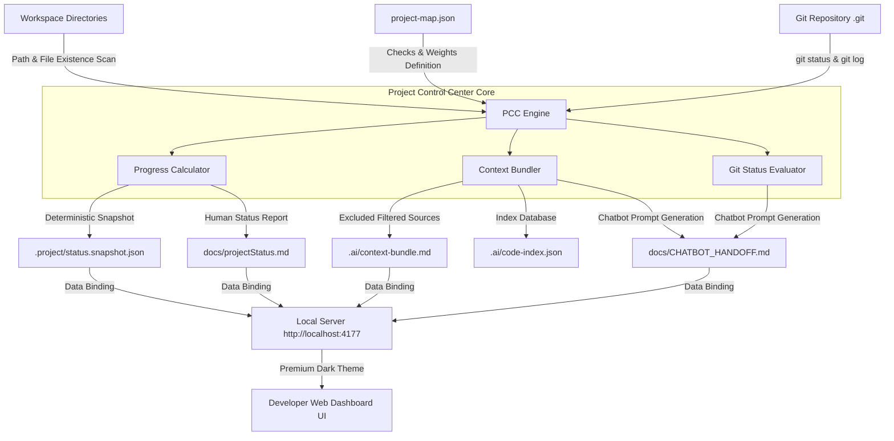

# AI Context Bundle

Generated: 2026-05-23T11:08:56.674Z

# Copyable Prompts

## chatbotHandoff

# Project Control Center

- Thoi diem scan: 2026-05-23T11:08:56.647Z
- Nhanh Git: main
- Trang thai: co thay doi
- Check hien co: 27
- Check thieu: 31

## Check thieu

- p0-docs-codex-tasks: docs/CODEX_TASKS.md
- p1-tsconfig: tsconfig.json
- p1-src: src
- p1-tests: tests
- p2-contracts-root: src/core/contracts
- p2-assessment-contract: src/core/contracts/assessment.ts
- p2-events-contract: src/core/contracts/events.ts
- p2-scoring-contract: src/core/contracts/scoring.ts
- p2-report-contract: src/core/contracts/report.ts
- p3-tracking-root: src/core/tracking
- p3-event-tracker: src/core/tracking/EventTracker.ts
- p3-focus-tracking: src/core/tracking/focusTracking.ts
- p3-event-validation: src/core/tracking/eventValidation.ts
- p4-orchestrator-root: src/core/orchestrator
- p4-test-orchestrator: src/core/orchestrator/TestOrchestrator.ts
- p4-module-registry: src/core/orchestrator/moduleRegistry.ts
- p4-state-machine: src/core/orchestrator/stateMachine.ts
- p5-scoring-root: src/core/scoring
- p5-scoring-engine: src/core/scoring/ScoringEngine.ts
- p5-data-quality: src/core/scoring/dataQuality.ts
- p5-normalization: src/core/scoring/normalization.ts
- p5-profile-aggregator: src/core/scoring/profileAggregator.ts
- p6-m2-module: src/modules/m2-inhibitory-control
- p6-m3-module: src/modules/m3-working-memory
- p6-m5-module: src/modules/m5-procedural-reasoning
- p6-m9-module: src/modules/m9-metacognition
- p7-report-root: src/report
- p7-export-root: src/export
- p7-radar-profile: src/report/RadarProfile.ts
- p7-export-json: src/export/exportJson.ts
- p7-export-csv: src/export/exportCsv.ts

## Tep thay doi

- .ai/code-index.json
- .ai/context-bundle.md
- .project/git-history.snapshot.json
- .project/scan-history.ndjson
- .project/status.snapshot.json
- docs/CHATBOT_HANDOFF.md
- docs/projectStatus.md

## gitDiffReview

# Git Diff Review


Nhanh: main

## Staged

- Khong co

## Unstaged

- .ai/code-index.json
- .ai/context-bundle.md
- .project/git-history.snapshot.json
- .project/scan-history.ndjson
- .project/status.snapshot.json
- docs/CHATBOT_HANDOFF.md
- docs/projectStatus.md

## Untracked

- Khong co

## Diff summary

-  .ai/code-index.json                |  2 +-
-  .ai/context-bundle.md              | 56 +++++++++++++-------------------------
-  .project/git-history.snapshot.json | 53 +++++++++++++-----------------------
-  .project/scan-history.ndjson       | 12 ++++++++
-  .project/status.snapshot.json      | 20 +++++++-------
-  docs/CHATBOT_HANDOFF.md            |  9 ++----
-  docs/projectStatus.md              |  4 +--
-  7 files changed, 66 insertions(+), 90 deletions(-)

## nextCodexPrompt

Use the project-control-center-builder skill.

Continue from the Project Control Center status snapshot.
Do not modify src/.
Use project-map.json as the only machine-readable progress source.
## Priority missing checks

- p0-docs-codex-tasks: docs/CODEX_TASKS.md
- p1-tsconfig: tsconfig.json
- p1-src: src
- p1-tests: tests
- p2-contracts-root: src/core/contracts
- p2-assessment-contract: src/core/contracts/assessment.ts
- p2-events-contract: src/core/contracts/events.ts
- p2-scoring-contract: src/core/contracts/scoring.ts
- p2-report-contract: src/core/contracts/report.ts
- p3-tracking-root: src/core/tracking

## architectureContext

# Architecture Context

Project Control Center is isolated under tools/project-control-center/.
Runtime progress input is tools/project-control-center/project-map.json only.
projectMap.md is documentation only.
Snapshots live in .project/.
AI exports live in .ai/.

## changedFilesContext

# Changed Files Context

## Tep thay doi

- .ai/code-index.json
- .ai/context-bundle.md
- .project/git-history.snapshot.json
- .project/scan-history.ndjson
- .project/status.snapshot.json
- docs/CHATBOT_HANDOFF.md
- docs/projectStatus.md

# Allowlisted Project Context

## AGENTS.md
```
# AGENTS.md

## Project identity

This project is an Interactive Cognitive-Behavioral Profile Assessment web app.

The app measures task performance, interaction style, behavioral evidence, and metacognitive calibration.

## Core product rules

- Never produce one global IQ/EQ-like score.
- Results must be multi-axis and evidence-based.
- Report language must be cautious, specific, and tied to observed behavior.
- Do not overclaim psychological meaning.
- Every assessment module must export raw trial logs.
- Every score must be reproducible from logged data.
- Scoring logic must be independent from UI code.
- Use performance.now() for client-side timing.
- Date.now() may be used only for timestamps, not response time measurement.

## MVP scope

Build the platform before the full item bank.

MVP modules:
1. M2 - Inhibitory Control
2. M3 - Working Memory
3. M5 - Procedural / Systems Reasoning
4. M9 - Metacognitive Calibration embedded after blocks

Do not build all 11 modules at once.

## Architecture rules

Required layers:
- Frontend Test App
- Event Tracker
- Local State Store
- Test Orchestrator
- Module Runtime
- Scoring Engine
- Scoring Adapters
- Data Quality Checker
- Profile Aggregator
- Report Generator
- JSON/CSV Export

Modules must not call each other directly.
Modules communicate only through:
- Test Orchestrator
- Profile Aggregator
- explicit typed contracts

## Data rules

Every trial result must include at least:
- sessionId
- participantId
- moduleId
- blockId
- trialId
- itemId
- condition
- difficulty
- correctResponse when applicable
- userResponse
- isCorrect
- partialScore
- responseTimeMs
- firstInteractionTimeMs
- hesitationTimeMs
- changedAnswerCount
- wrongClickCount
- skipped
- timedOut
- focusLossCount
- invalidFlags

Every raw event must include:
- eventId
- eventType
- sessionId
- moduleId
- trialId when applicable
- clientTimeMs from performance.now()
- timestamp
- payload

## Engineering conventions

Tech stack:
- Frontend: Vite + Vanilla TypeScript
- Backend: Node.js + Express

Use TypeScript.
Prefer small, pure functions for scoring.
Do not mix scoring code with UI components.
All scoring adapters must have unit tests.
All schemas must be versioned.
Use explicit types; avoid `any` unless unavoidable.
Prefer deterministic tests over visual-only validation.

## Project Control Center (PCC) Integration

To maintain progress visibility and consistent AI collaboration, the project utilizes the **Project Control Center (PCC)** developer tool located under `tools/project-control-center`.

- **Machine-readable roadmap:** All development checklist checks, weights, and phase files are defined in `tools/project-control-center/project-map.json`.
- **Dynamic Status Scanning:** Before claiming any task or module complete, developers or AI agents must run:
  ```bash
  npm run pcc:scan
  ```
  This command will scan the repository and update `docs/projectStatus.md`, `docs/CHATBOT_HANDOFF.md`, and `.project/status.snapshot.json` with the latest objective progress indicators.
- **AI Handoffs:** To hand off context to another session or AI agent, use:
  ```bash
  npm run pcc:export
  ```
  This generates `.ai/context-bundle.md` containing all relevant, sanitized codebase context (excluding secrets, node_modules, build output, and binary files).

## Required checks before claiming done

Run:
- npm run typecheck
- npm run lint
- npm test
- npm run build

If a command does not exist yet, create the minimal script or explain why it cannot be run.

## Definition of done for a module

A module is done only when it has:
- interaction spec
- item schema
- runtime implementation
- tracking events
- scoring adapter
- data quality flags
- unit tests
- demo item bank
- JSON/CSV export compatibility
- safe report templates
```

## DESIGN.md
```
---
version: 1.0.0
name: Mind-Radar-Clinical-Design
description: A clinical, high-focus design system for cognitive-behavioral assessments. Merges the institutional calm and monospace precision of Coinbase with the serious, low-cognitive-load geometry of Notion.

colors:
  primary: "#0052ff"
  primary-pressed: "#003ecc"
  on-primary: "#ffffff"
  brand-navy: "#0a1530"
  canvas: "#ffffff"
  surface: "#f7f7f7"
  surface-elevated: "#ffffff"
  hairline: "#dee1e6"
  hairline-strong: "#c8c4be"
  ink: "#0a0b0d"
  ink-muted: "#5b616e"
  semantic-correct: "#05b169"
  semantic-incorrect: "#cf202f"
  semantic-warning: "#dd5b00"
  module-tint-stroop: "#fde0ec"
  module-tint-memory: "#dcecfa"
  module-tint-spatial: "#d9f3e1"

typography:
  display-lg:
    fontFamily: "Inter, -apple-system, sans-serif"
    fontSize: 48px
    fontWeight: 600
    lineHeight: 1.15
    letterSpacing: -0.5px
  heading-md:
    fontFamily: "Inter, -apple-system, sans-serif"
    fontSize: 28px
    fontWeight: 600
    lineHeight: 1.25
    letterSpacing: 0
  body-lg:
    fontFamily: "Inter, -apple-system, sans-serif"
    fontSize: 18px
    fontWeight: 400
    lineHeight: 1.5
  body-md:
    fontFamily: "Inter, -apple-system, sans-serif"
    fontSize: 16px
    fontWeight: 400
    lineHeight: 1.5
  number-metric:
    fontFamily: "'JetBrains Mono', 'Geist Mono', monospace"
    fontSize: 20px
    fontWeight: 500
    lineHeight: 1.4
  button:
    fontFamily: "Inter, -apple-system, sans-serif"
    fontSize: 16px
    fontWeight: 500

rounded:
  none: 0px
  sm: 4px
  md: 8px
  lg: 12px
  xl: 16px
  full: 9999px

spacing:
  xs: 8px
  sm: 16px
  md: 24px
  lg: 32px
  xl: 48px
  section: 96px

components:
  test-canvas:
    backgroundColor: "{colors.canvas}"
    textColor: "{colors.ink}"
    padding: "{spacing.section}"
  button-primary:
    backgroundColor: "{colors.primary}"
    textColor: "{colors.on-primary}"
    typography: "{typography.button}"
    rounded: "{rounded.md}"
    padding: 12px 24px
  button-outline:
    backgroundColor: "transparent"
    textColor: "{colors.ink}"
    border: "1px solid {colors.hairline-strong}"
    typography: "{typography.button}"
    rounded: "{rounded.md}"
    padding: 12px 24px
  card-module:
    backgroundColor: "{colors.surface-elevated}"
    textColor: "{colors.ink}"
    rounded: "{rounded.lg}"
    padding: "{spacing.lg}"
    border: "1px solid {colors.hairline}"
    shadow: "0 4px 12px rgba(0, 0, 0, 0.04)"
  metric-cell:
    backgroundColor: "{colors.surface}"
    textColor: "{colors.ink}"
    typography: "{typography.number-metric}"
    rounded: "{rounded.md}"
    padding: "{spacing.sm} {spacing.md}"
---

## Overview

This application is a clinical cognitive-behavioral assessment tool. The UI must ensure **Zero Cognitive Load**. Extraneous visual elements, animations, or heavy shadows will skew the user's reaction times (ms). The interface should feel like a modern, precise psychology laboratory.

## Colors

- **Canvas & Surface:** Pure white (`{colors.canvas}`) is the default background for all testing interfaces. Soft gray (`{colors.surface}`) is used only to group elements outside of active testing.
- **Primary Action:** Trustworthy clinical blue (`{colors.primary}`). Used strictly for "Next", "Start Test", or primary submit actions.
- **Semantics:** Correct/Incorrect feedback must use the exact `{colors.semantic-correct}` and `{colors.semantic-incorrect}` values.
- **Module Tints:** Pastel tints are reserved ONLY for the dashboard/menu to differentiate modules (e.g., Stroop vs. Working Memory), never during an active test.

## Typography

- **Inter (Sans-serif):** The universal font for instructions, buttons, and headings. Weight never exceeds 600.
- **Monospace for Metrics:** ANY display of reaction time (ms), scores, or active countdown timers MUST use a monospace font (`{typography.number-metric}`). This prevents the UI from jittering when numbers rapidly change.

## Layout & Spacing

- Generous whitespace is mandatory. Use `{spacing.section}` (96px) to isolate the testing stimulus in the center of the screen.
- The interface must remain absolutely static during a test block. No layout shifting.

## Shapes & Elevation

- **Sober Geometry:** Buttons use `{rounded.md}` (8px). We use rectangles, not rounded pills, to maintain a serious, academic tone.
- **Flat Design:** Shadows are restricted to a single, ultra-light tier (`0 4px 12px rgba(0,0,0,0.04)`) for dashboard cards. Active testing interfaces are completely flat.

## Do's and Don'ts

- **Do** center the primary stimulus (text, image) perfectly in the viewport during test execution.
- **Do** use monospace fonts for all rapid-changing numbers.
- **Don't** use transition animations for stimuli in speed-based tests (Module 2, 7). They must appear instantly (0ms render).
- **Don't** introduce new accent colors. Stick strictly to Ink, Blue, and White during active testing.
```

## README.md
```
# Mind Radar ◼ Interactive Cognitive-Behavioral Profile Assessment

> Hệ thống đo lường và đánh giá đa chiều hiệu suất nhiệm vụ, phong cách tương tác, minh chứng hành vi, và mức độ hiệu chuẩn siêu nhận thức (Metacognitive Calibration).

[](#)
[](#)
[](#)
[](#)
[](#)

---

## ⬢ Table of Contents

- [Giới thiệu & Triết lý cốt lõi](#-giới-thiệu--triết-lý-cốt-lõi)
- [Kiến trúc Agent-First](#-kiến-trúc-agent-first-agentsmd--geminimd)
- [Design System & Zero Cognitive Load](#-design-system--zero-cognitive-load-designmd)
- [Project Control Center (PCC)](#-project-control-center-pcc-toolsproject-control-center)
- [Bản đồ Hệ thống Modules Đánh giá](#-bản-đồ-hệ-thống-modules-đánh-giá)
- [Khởi chạy Dự án (Getting Started)](#-khởi-chạy-dự-án-getting-started)
- [Quy chuẩn Phát triển (Definition of Done)](#-quy-chuẩn-phát-triển-definition-of-done)

---

## ⬢ Giới thiệu & Triết lý cốt lõi

**Mind Radar** là một nền tảng web tương tác chuyên sâu, được thiết kế nhằm đo lường các khía cạnh nhận thức và hành vi của người sử dụng thông qua các tác vụ khoa học chuẩn hóa. Hệ thống tuân thủ nghiêm ngặt các nguyên lý y sinh và tâm lý học thực nghiệm:

- **Không dán nhãn đơn giản:** Tuyệt đối không quy đổi về một điểm số IQ/EQ duy nhất. Thay vào đó, kết quả được phân tích và biểu diễn đa chiều thông qua biểu đồ Radar.
- **Minh chứng hành vi rõ ràng:** Mọi nhận định trong báo cáo đều phải có cơ sở bằng dữ liệu hành vi thực tế (như thời gian phản ứng, thời gian do dự, số lần đổi đáp án).
- **Khách quan và thận trọng:** Ngôn ngữ báo cáo y khoa trung thực, không phóng đại hoặc suy diễn quá mức ý nghĩa tâm lý học ngoài phạm vi thực nghiệm.

---

## ⬢ Kiến trúc Agent-First (`AGENTS.md` & `GEMINI.md`)

Dự án được thiết kế theo mô hình **Agent-First**, được tối ưu hóa cho sự cộng tác giữa con người và các trợ lý AI (đặc biệt là **Antigravity**). Mọi thay đổi logic và cấu trúc đều phải tuân thủ nghiêm ngặt hai tài liệu chỉ dẫn cốt lõi:
1. **[AGENTS.md](AGENTS.md):** Định hình các quy tắc sản phẩm, mô hình luồng dữ liệu, schema sự kiện, và tiêu chí hoàn thành nhiệm vụ.
2. **[GEMINI.md](GEMINI.md):** Thiết lập ngữ cảnh hoạt động cho AI, quy trình duyệt kế hoạch triển khai (Implementation Plan) trước khi viết code, và cơ chế kiểm nghiệm bằng Browser Agent.

### Luồng Kỹ thuật Nghiêm ngặt (Strict Architecture)

Hệ thống được chia nhỏ thành các tầng độc lập để đảm bảo khả năng tái cấu trúc và kiểm thử tối đa:

```
Frontend Test App ◼ [Giao diện người dùng]
  │
  ├──► Event Tracker [Ghi nhận sự kiện thời gian thực]
  │      │
  │      └──► Local State Store [Lưu trữ trạng thái cục bộ chống mất dữ liệu]
  │
  └──► Test Orchestrator [Điều phối phiên đánh giá]
         │
         ├──► Module Runtime [Môi trường thực thi từng Module]
         │      │
         │      └──► Raw Session Logs [Nhật ký thô toàn bộ phiên]
         │
         └──► Scoring Engine & Adapters [Động cơ tính toán độc lập hoàn toàn khỏi UI]
                │
                ├──► Data Quality Checker [Kiểm định chất lượng & Gán cờ bất thường]
                │
                └──► Profile Aggregator [Tích hợp hồ sơ đa chiều]
                       │
                       └──► Report Generator [Tạo báo cáo khoa học & Xuất JSON/CSV]
```

> [!IMPORTANT]
> **Quy tắc cô lập:** Các Module đánh giá tuyệt đối không được phép giao tiếp trực tiếp với nhau. Mọi luồng dữ liệu phải đi qua `TestOrchestrator` và `ProfileAggregator` dựa trên các Contract kiểu dữ liệu tường minh tại [moduleContracts.md](docs/moduleContracts.md).
>
> **Đo lường thời gian:** Sử dụng `performance.now()` cho mọi phép đo thời gian phản ứng ở phía Client (Response Time, Hesitation Time) nhằm đạt độ chính xác mili-giây cao nhất. Tuyệt đối không sử dụng `Date.now()` cho mục đích này.

---

## ⬢ Design System & Zero Cognitive Load (`DESIGN.md`)

Giao diện của Mind Radar được thiết kế dựa trên triết lý **Zero Cognitive Load** (Tải nhận thức bằng Không). Mọi chi tiết thừa, hiệu ứng chuyển động phức tạp hoặc bóng đổ quá mức đều bị loại bỏ để tránh gây nhiễu và làm sai lệch thời gian phản xạ (ms) của người dùng.

Tham khảo tài liệu hệ thống thiết kế chi tiết tại **[DESIGN.md](DESIGN.md)**.

### Các Quy tắc Thiết kế Bắt buộc:
- **Bảng màu Clinical & High-Focus:** Chỉ sử dụng màu nền Canvas trắng (`#ffffff`) hoặc Surface xám nhạt (`#f7f7f7`) trong suốt quá trình làm bài test để giữ sự tập trung tối đa.
- **Font chữ Monospace cho Số liệu:** Toàn bộ các thông số thay đổi liên tục (mili-giây, điểm số, đồng hồ đếm ngược) bắt buộc phải sử dụng font chữ Monospace (`JetBrains Mono` hoặc `Geist Mono`) nhằm ngăn chặn hiện tượng UI bị giật (layout shift).
- **Hình học nghiêm túc:** Nút bấm và các thẻ sử dụng bo góc vừa phải (`rounded.md` - 8px), tuyệt đối không dùng thiết kế dạng kẹo dẻo hay viên thuốc (pill) để duy trì tính chuyên nghiệp, học thuật.

---

## ⬢ Project Control Center (PCC) (`tools/project-control-center`)

**Project Control Center (PCC)** là một bộ công cụ dashboard và CLI chuyên biệt dành cho nhà phát triển để theo dõi tiến độ hoàn thành MVP, giám sát trạng thái Git, xuất ngữ cảnh làm việc cho AI (Codex/Gemini), và đồng bộ các tài liệu trạng thái dự án một cách tự động và nhất quán.

Chi tiết về đặc tả kỹ thuật và kiến trúc của công cụ này có thể xem tại **[controlCenterSpec.md](tools/project-control-center/controlCenterSpec.md)**.

### Các Tính năng cốt lõi:
- **Đo lường tiến độ MVP tự động:** Phân tích cấu trúc thư mục thực tế của repository và đối chiếu với bản đồ kiểm soát tiến độ `project-map.json` để tính toán chính xác phần trăm hoàn thành theo trọng số.
- **Đồng bộ hóa Tài liệu tiến độ:** Tự động tạo và cập nhật các file [projectStatus.md](docs/projectStatus.md) và [CHATBOT_HANDOFF.md](docs/CHATBOT_HANDOFF.md) mỗi khi thực hiện quét (scan) dự án.
- **Xuất Ngữ cảnh AI an toàn (Context Exporters):** Tạo file bundle mã nguồn `.ai/context-bundle.md` và `.ai/code-index.json` loại bỏ hoàn toàn các file nhạy cảm (`.env`, `node_modules`, các file build, và file nhị phân) để phục vụ việc nạp ngữ cảnh nhanh cho AI.
- **Giao diện Dashboard trực quan:** Cung cấp giao diện web cục bộ hiện đại giúp theo dõi trực quan và copy nhanh các mẫu prompt huấn luyện Codex/AI.

### Khởi chạy PCC nhanh từ Thư mục gốc (Root Proxy Commands):
Hệ thống đã tích hợp sẵn các script proxy tại file cấu hình thư mục gốc `package.json` để chạy nhanh công cụ:

| Lệnh tại Root | Tác dụng |
| :--- | :--- |
| `npm run pcc:install` | Cài đặt các thư viện phụ thuộc của PCC |
| `npm run pcc:scan` | Thực hiện quét toàn bộ repo và cập nhật các tài liệu báo cáo tiến độ |
| `npm run pcc:dev` | Khởi chạy máy chủ giao diện Dashboard cục bộ tại `http://127.0.0.1:5174` |
| `npm run pcc:test` | Khởi chạy bộ unit test tự động xác thực công cụ PCC |
| `npm run pcc:build` | Xây dựng phiên bản build tĩnh của Dashboard |
| `npm run pcc:export` | Xuất nhanh file context bundle `.ai/context-bundle.md` |

---

## ⬢ Bản đồ Hệ thống Modules Đánh giá

Dự án Mind Radar bao gồm 11 Module đánh giá thuộc 4 lõi năng lực cốt lõi và 1 Module tự đánh giá tích hợp:

| Ký hiệu | Tên Module (VI / EN) | Lõi Năng Lực | Nhiệm vụ chính | Trạng thái MVP |
| :--- | :--- | :--- | :--- | :---: |
| **M1** | Nhịp Suy Luận<br>*(Fluid Reasoning & Processing Speed)* | Nhận thức & Tốc độ | Tìm quy luật chuỗi số, ma trận hình học dưới 2 pha: chậm và giới hạn thời gian. | Tương lai |
| **M2** | Bộ Lọc Phản Xạ<br>*(Inhibitory Control)* | Nhận thức & Tốc độ | Chống lại phản xạ bản năng thông qua Stroop Task và Go/No-Go Task. | **MVP Core** |
| **M3** | Bộ Nhớ Thao Tác<br>*(Working Memory)* | Nhận thức & Tốc độ | Tái hiện chuỗi Corsi Block theo chiều thuận (Forward) và ngược (Backward). | **MVP Core** |
| **M4** | Không Gian Hình Khối<br>*(Spatial Reasoning)* | Không gian & Hệ thống | Nhận diện, xoay 3D và ghép mảnh vật thể còn thiếu. | Tương lai |
| **M5** | Bản Đồ Quy Trình<br>*(Procedural / Systems Reasoning)* | Không gian & Hệ thống | Sắp xếp các bước quy trình đóng/mở theo thứ tự tối ưu nhất. | **MVP Core** |
| **M6** | Chuyển Luật<br>*(Cognitive Flexibility)* | Không gian & Hệ thống | Phân loại thẻ bài và tự động thích ứng khi luật phân loại thay đổi ẩn. | Tương lai |
| **M7** | Phản Ứng Ưu Tiên<br>*(Fast Preference Response)* | Hành vi & Quyết định | Lựa chọn phản ứng nhanh (Swipe) đối với các nhóm từ khóa/hình ảnh. | Tương lai |
| **M8** | Chiến Lược Rủi Ro<br>*(Risk-taking Under Uncertainty)* | Hành vi & Quyết định | Bơm bóng bay tích điểm (BART Task) để đo lường hành vi chấp nhận rủi ro. | Tương lai |
| **M9** | Gương Hiệu Chuẩn<br>*(Metacognitive Calibration)* | Tự Đánh Giá Xuyên Suốt | Đo sai số giữa mức độ tự tin tự đánh giá và hiệu suất thực tế sau mỗi block. | **MVP Core** |
| **M10** | Phòng Thí Nghiệm Tư Duy<br>*(Open-ended Problem Solving)* | Tư Duy Bậc Cao | Giải quyết vấn đề mở qua 4 bước: Tách vấn đề, giả thuyết, chiến lược, tự phản biện. | Tương lai |
| **M11** | Suy Luận Ngôn Ngữ<br>*(Verbal Reasoning)* | Tư Duy Bậc Cao | Đọc hiểu logic, phát hiện mâu thuẫn lập luận và tìm quan hệ tương đồng từ vựng. | Tương lai |

---

## ⬢ Khởi chạy Dự án (Getting Started)

### Yêu cầu hệ thống
- **Node.js** >= 18.0.0
- **npm** >= 9.0.0

### Các bước thiết lập ban đầu

1. Cài đặt các gói phụ thuộc:
   ```bash
   npm install
   ```

2. Khởi chạy máy chủ phát triển (Development Server):
   ```bash
   npm run dev
   ```

3. Khởi chạy bộ kiểm thử tự động (Unit Tests):
   ```bash
   npm test
   ```

4. Kiểm tra kiểu dữ liệu TypeScript tĩnh:
   ```bash
   npm run typecheck
   ```

5. Kiểm tra và định dạng mã nguồn (Linter):
   ```bash
   npm run lint
   ```

6. Xây dựng mã nguồn cho môi trường Production:
   ```bash
   npm run build
   ```

---

## ⬢ Quy chuẩn Phát triển (Definition of Done)

Mỗi Module hoặc thành phần logic mới chỉ được coi là hoàn tất khi và chỉ khi đáp ứng đầy đủ các tiêu chuẩn khắt khe sau:

- **Interaction Spec:** Có văn bản mô tả chi tiết các tương tác người dùng.
- **Item Schema:** Định nghĩa rõ phiên bản schema của item ngân hàng câu hỏi.
- **Pure Scoring Adapter:** Hàm tính điểm thuần túy được tách biệt hoàn toàn khỏi mã nguồn UI và được kiểm thử 100%.
- **Behavioral Tracking:** Ghi nhận đầy đủ các trường thông tin quy định tại `AGENTS.md` (responseTimeMs, hesitationTimeMs, changedAnswerCount, v.v.).
- **Unit Tests:** Có các bài kiểm thử xác thực logic chính xác tuyệt đối.
- **Zero-Error Build:** Vượt qua toàn bộ quy trình `typecheck`, `lint`, `test`, và `build` mà không có bất kỳ cảnh báo (warning) hay lỗi (error) nào.
```

## docs/ARCHITECTURE.md
```
# Architecture

## Technical flow

Frontend Test App
-> Event Tracker
-> Local State Store
-> Test Orchestrator
-> Module Runtime
-> Raw Session Logs
-> Scoring Engine
-> Scoring Adapters
-> Data Quality Checker
-> Normalization Engine
-> Profile Aggregator
-> Report Generator

## Hard rule

Assessment modules never communicate directly with each other.

Correct flow:
Module -> Orchestrator -> Profile Aggregator -> Report

## Frontend responsibilities

- Render tasks.
- Capture interactions.
- Use performance.now() for RT.
- Save recoverable state locally.
- Submit responses to module runtime.
- Export raw logs.

## Scoring responsibilities

- Validate events.
- Reconstruct trials.
- Compute trial score.
- Aggregate module metrics.
- Apply data quality flags.
- Generate safe evidence-backed report data.
```

## docs/CHATBOT_HANDOFF.md
```
# Chatbot Handoff

Generated: 2026-05-23T11:08:56.169Z
Scan: 2026-05-23T11:08:56.141Z
Git branch: main

## Handoff Prompt
# Project Control Center

- Thoi diem scan: 2026-05-23T11:08:56.141Z
- Nhanh Git: main
- Trang thai: co thay doi
- Check hien co: 27
- Check thieu: 31

## Check thieu

- p0-docs-codex-tasks: docs/CODEX_TASKS.md
- p1-tsconfig: tsconfig.json
- p1-src: src
- p1-tests: tests
- p2-contracts-root: src/core/contracts
- p2-assessment-contract: src/core/contracts/assessment.ts
- p2-events-contract: src/core/contracts/events.ts
- p2-scoring-contract: src/core/contracts/scoring.ts
- p2-report-contract: src/core/contracts/report.ts
- p3-tracking-root: src/core/tracking
- p3-event-tracker: src/core/tracking/EventTracker.ts
- p3-focus-tracking: src/core/tracking/focusTracking.ts
- p3-event-validation: src/core/tracking/eventValidation.ts
- p4-orchestrator-root: src/core/orchestrator
- p4-test-orchestrator: src/core/orchestrator/TestOrchestrator.ts
- p4-module-registry: src/core/orchestrator/moduleRegistry.ts
- p4-state-machine: src/core/orchestrator/stateMachine.ts
- p5-scoring-root: src/core/scoring
- p5-scoring-engine: src/core/scoring/ScoringEngine.ts
- p5-data-quality: src/core/scoring/dataQuality.ts
- p5-normalization: src/core/scoring/normalization.ts
- p5-profile-aggregator: src/core/scoring/profileAggregator.ts
- p6-m2-module: src/modules/m2-inhibitory-control
- p6-m3-module: src/modules/m3-working-memory
- p6-m5-module: src/modules/m5-procedural-reasoning
- p6-m9-module: src/modules/m9-metacognition
- p7-report-root: src/report
- p7-export-root: src/export
- p7-radar-profile: src/report/RadarProfile.ts
- p7-export-json: src/export/exportJson.ts
- p7-export-csv: src/export/exportCsv.ts

## Tep thay doi

- .ai/code-index.json
- .ai/context-bundle.md
- .project/git-history.snapshot.json
- .project/scan-history.ndjson
- .project/status.snapshot.json
- docs/CHATBOT_HANDOFF.md
- docs/projectStatus.md

## Next Codex Prompt
Use the project-control-center-builder skill.

Continue from the Project Control Center status snapshot.
Do not modify src/.
Use project-map.json as the only machine-readable progress source.
## Priority missing checks

- p0-docs-codex-tasks: docs/CODEX_TASKS.md
- p1-tsconfig: tsconfig.json
- p1-src: src
- p1-tests: tests
- p2-contracts-root: src/core/contracts
- p2-assessment-contract: src/core/contracts/assessment.ts
- p2-events-contract: src/core/contracts/events.ts
- p2-scoring-contract: src/core/contracts/scoring.ts
- p2-report-contract: src/core/contracts/report.ts
- p3-tracking-root: src/core/tracking
```

## docs/TDD.md
```
# Tài liệu Thiết kế (TDD) - Bài Đánh Giá Nhận Thức & Hành Vi
*(Interactive Cognitive-Behavioral Profile Assessment)*

## 1. Mục Tiêu & Yêu Cầu Cơ Bản

* **Định vị:** Đây là **bài đánh giá tương tác về hồ sơ nhận thức – hành vi** dưới nhiều dạng nhiệm vụ (không đo lường IQ/EQ tuyệt đối, không dán nhãn "thiên tài" hay "bản chất tiềm thức").
* **Mục tiêu đo lường:** Đánh giá hiệu suất và phong cách xử lý thông tin của người dùng.
* **Hình thức:** Ứng dụng Web tương tác (Interactive Gamification).
* **Độ tin cậy nội bộ (Internal Reliability):** Cần đảm bảo đủ số lượng câu hỏi (items/trials) trong mỗi module để kết quả đo lường mang tính ổn định và khoa học.
* **Hệ thống thu thập dữ liệu (Behavioral Tracking):** Không chỉ chấm điểm đúng/sai, hệ thống phải ngầm ghi nhận chi tiết:
  * Thời gian phản ứng (Response time - ms).
  * Thời gian do dự / Khựng lại (Hover/Hesitation time - ms).
  * Số lần thử lại / Số lần nhấp chuột sai.
  * Số lần thay đổi đáp án.
  * Tỷ lệ bỏ qua.
* **Chuẩn hóa & Báo cáo kết quả:**
  * Không dùng một điểm tổng duy nhất.
  * Hiển thị kết quả bằng **Biểu đồ Radar đa trục (Radar Chart)** dựa trên điểm phân vị (percentile) hoặc điểm chuẩn hóa nội bộ (normalized score).
  * Lời giải thích kết quả phải dựa trên hành vi cụ thể (VD: "Bạn xử lý tốt hơn ở nhóm nhiệm vụ không gian so với phản ứng tốc độ"), tránh kết luận quá mức (overclaim).
* **Xuất dữ liệu:** Toàn bộ lịch sử hành vi (logs) phải được xuất ra định dạng `.json` hoặc `.csv` rõ ràng theo từng trial.

---

## 2. Cấu Trúc Đánh Giá (11 Module)

Bài test chia thành 4 lõi năng lực cốt lõi, cùng một module tự đánh giá lồng ghép xuyên suốt quá trình.

* **Lõi 1: Nhận thức & Tốc độ (Xử lý thông tin thô)**
  * Module 1: Nhịp Suy Luận (Fluid Reasoning & Processing Speed)
  * Module 2: Bộ Lọc Phản Xạ (Inhibitory Control)
  * Module 3: Bộ Nhớ Thao Tác (Working Memory)

* **Lõi 2: Không gian & Hệ thống (Tổ chức thông tin)**
  * Module 4: Không Gian Hình Khối (Spatial Reasoning)
  * Module 5: Bản Đồ Quy Trình (Procedural / Systems Reasoning)
  * Module 6: Chuyển Luật (Cognitive Flexibility)

* **Lõi 3: Hành vi & Quyết định (Phản ứng với môi trường)**
  * Module 7: Phản Ứng Ưu Tiên (Fast Preference Response)
  * Module 8: Chiến Lược Rủi Ro (Risk-taking Under Uncertainty)

* **Lõi 4: Tư Duy Bậc Cao (Ngôn ngữ & Giải quyết vấn đề)**
  * Module 10: Phòng Thí Nghiệm Tư Duy (Open-ended Problem Solving)
  * Module 11: Suy Luận Ngôn Ngữ (Verbal Reasoning)

* **Xuyên suốt (Lồng ghép vào từng block/task nhỏ):**
  * Module 9: Gương Hiệu Chuẩn (Metacognitive Calibration)

---

## 3. Chi Tiết Các Module & Chỉ Số Đo Lường

### Lõi 1: Nhận thức & Tốc độ

**1. Module 1: Nhịp Suy Luận (Fluid Reasoning & Processing Speed)**
* **Nhiệm vụ:** Tìm quy luật chuỗi số, ma trận hình học (tương tự Raven's matrices, tự thiết kế).
* **Tương tác:** Click chọn đáp án. Có 2 pha: Pha chậm (không áp lực thời gian) và Pha áp lực (giới hạn thời gian gắt gao).
* **Khuyến nghị số lượng:** 16 – 24 câu.
* **Chỉ số cần tính:**
  * *Accuracy Logic:* Tỷ lệ đúng ở pha chậm.
  * *Speeded Reasoning:* Tỷ lệ đúng ở pha áp lực.
  * *Speed–Accuracy Style:* Đánh giá phong cách (nhanh mà sai / chậm mà chắc / nhanh và chuẩn).

**2. Module 2: Bộ Lọc Phản Xạ (Inhibitory Control)**
* **Nhiệm vụ:** Chống lại phản xạ bản năng (ví dụ Stroop Task: Chữ "ĐỎ" tô mực xanh lá -> Phải chọn màu "xanh lá"). Bổ sung thêm Go/No-Go task (Thấy xanh -> bấm, đỏ -> không bấm).
* **Tương tác:** Bấm phím tắt hoặc click tốc độ cao.
* **Khuyến nghị số lượng:** 60 – 120 trials ngắn.
* **Chỉ số cần tính:**
  * *Interference Cost:* Thời gian chậm đi ở những trial có yếu tố gây nhiễu so với trial thường.
  * *False Press Rate:* Tỷ lệ bấm nhầm (không kìm được phản xạ).
  * *Recovery Time:* Thời gian lấy lại sự ổn định sau khi chọn sai.

**3. Module 3: Bộ Nhớ Thao Tác (Working Memory)**
* **Nhiệm vụ:** Ghi nhớ và tái hiện chuỗi thông tin (Corsi block). Hệ thống hiển thị thứ tự các ô sáng lên.
* **Tương tác:** Nhấp chuột theo trình tự.
* **Chế độ (Modes):**
  * *Forward Corsi:* Bấm lại đúng thứ tự (Đo Spatial short-term memory).
  * *Backward Corsi:* Bấm ngược thứ tự (Đo Working memory manipulation).
* **Khuyến nghị số lượng:** 8 – 12 chuỗi với độ khó tăng dần.

### Lõi 2: Không gian & Hệ thống

**4. Module 4: Không Gian Hình Khối (Spatial Reasoning)**
* **Nhiệm vụ:** Nhận diện, xoay 2D/3D và ghép các mảnh vật thể còn thiếu.
* **Tương tác:** Kéo thả (Drag & Drop), xoay đối tượng.
* **Khuyến nghị số lượng:** 12 – 20 items.
* **Chỉ số cần tính:**
  * Điểm thành phần: *Mental Rotation* (xoay hình), *Spatial Assembly* (ghép hình), *Visual Completion* (tìm mảnh khuyết).
  * *Drag Efficiency:* Số lần thử và sai trong thao tác kéo thả (tìm đúng nhưng thử 20 lần vs. xếp đúng ngay từ đầu).

**5. Module 5: Bản Đồ Quy Trình (Procedural / Systems Reasoning)**
* **Nhiệm vụ:** Sắp xếp các bước lộn xộn của một kế hoạch thành trình tự hợp lý.
* **Phân loại:**
  * *Quy trình đóng:* Có trình tự kỹ thuật đúng/sai rõ ràng.
  * *Quy trình mở:* Xử lý tình huống linh hoạt (ví dụ: sinh tồn). Chấm theo rubric ưu tiên (an toàn, tài nguyên...).
* **Tương tác:** Kéo thả để sắp xếp danh sách (Sortable list).
* **Khuyến nghị số lượng:** 8 – 12 bài.
* **Chỉ số cần tính:** Số lần đảo vị trí, thời gian tư duy trước lần kéo đầu tiên, độ logic từ trên xuống dưới.

**6. Module 6: Chuyển Luật (Cognitive Flexibility)**
* **Nhiệm vụ:** Phân loại thẻ bài. Ban đầu phân loại theo "Màu sắc", hệ thống ngầm đổi luật thành "Hình dáng" mà không báo trước. Người chơi tự nhận ra luật mới qua phản hồi Đúng/Sai.
* **Tương tác:** Click phân loại.
* **Khuyến nghị số lượng:** 40 – 80 lượt phân loại.
* **Chỉ số cần tính:**
  * *Trials to Rule Discovery:* Số lượt để nhận ra luật mới.
  * *Perseverative Errors:* Lỗi bám luật cũ khi luật đã đổi.
  * *Switch Cost:* Mức độ giảm hiệu suất ngay sau khi đổi luật.
  * *Feedback Learning:* Khả năng tự điều chỉnh sau khi nhận phản hồi sai.

### Lõi 3: Hành vi & Quyết định

**7. Module 7: Phản Ứng Ưu Tiên (Fast Preference Response)**
* **Nhiệm vụ:** Lựa chọn thích/không thích trước hàng loạt từ khóa/hình ảnh (công nghệ, xã hội, nghệ thuật, tự nhiên, rủi ro) dưới sức ép thời gian. Đo phản ứng nhanh, không kết luận khuynh hướng nghề nghiệp tuyệt đối.
* **Tương tác:** Vuốt thẻ trái/phải (Swipe) giới hạn trong khoảng 1.5s/thẻ.
* **Khuyến nghị số lượng:** 80 – 150 thẻ (khoảng 20 thẻ mỗi nhóm).
* **Chỉ số cần tính:**
  * *Approach/Avoidance Rate:* Tỷ lệ vuốt thích/bỏ qua.
  * *Response Latency:* Độ trễ phản ứng.
  * *Hesitation Rate:* Tỷ lệ lưỡng lự (quá thời gian quy định).
  * *Category Consistency:* Sự nhất quán trong các lựa chọn cùng nhóm.

**8. Module 8: Chiến Lược Rủi Ro (Risk-taking under uncertainty)**
* **Nhiệm vụ:** Bơm bóng bay ảo để kiếm điểm (tương tự bài test BART). Bơm càng to điểm càng cao, nhưng bóng nổ sẽ mất điểm. Phân chia rõ các điều kiện: Xác suất rõ ràng (70% an toàn) vs. Mơ hồ (Không báo trước tỷ lệ).
* **Tương tác:** Nhập số hoặc bấm giữ nút "Bơm".
* **Khuyến nghị số lượng:** 20 – 40 rounds (lượt bóng).
* **Chỉ số cần tính:**
  * *Average Adjusted Pumps:* Mức bơm trung bình ở những bóng không nổ.
  * *Explosion Rate:* Tỷ lệ làm nổ bóng.
  * *Post-loss Adjustment:* Độ điều chỉnh mức cược (sợ hãi/cẩn trọng) sau khi bóng nổ.
  * *Ambiguity Tolerance:* Hành vi đánh cược trong điều kiện thông tin mơ hồ.

### Lõi 4: Tư Duy Bậc Cao

**10. Module 10: Phòng Thí Nghiệm Tư Duy (Open-ended Problem Solving)**
* **Nhiệm vụ:** Giải quyết một vấn đề mở (ví dụ: "Thiết kế app giúp học sinh học tốt hơn", "Tối ưu lịch học 7 ngày trước kỳ thi", "Tìm nguyên nhân vì sao một web app bị chậm", "Lập kế hoạch kiếm 1 triệu đầu tiên bằng kỹ năng số", "Thiết kế bài test nhận thức này sao cho ít sai lệch hơn"). Yêu cầu thực hiện tuần tự 4 bước: Tách vấn đề, Đặt giả thuyết, Chọn chiến lược, và Tự đánh giá điểm yếu.
* **Tương tác:** Nhập liệu văn bản (Text input), chọn lựa chiến lược, tự phản biện.
* **Chỉ số cần tính:**
  * *Problem Decomposition:* Khả năng chia vấn đề lớn thành các phần nhỏ dễ xử lý.
  * *Causal Reasoning:* Khả năng phân biệt nguyên nhân gốc rễ và triệu chứng bề mặt.
  * *Constraint Awareness:* Nhận diện rõ các giới hạn về thời gian, dữ liệu, nguồn lực.
  * *Trade-off Thinking:* Nhận thức được tính đánh đổi (được cái này, mất cái kia) trong các giải pháp.
  * *Self-correction:* Tự phát hiện và chỉ ra lỗ hổng trong phương án vừa lập.
  * *Transfer:* Khả năng tận dụng kiến thức/quy luật từ các module trước áp dụng vào vấn đề mới.

**11. Module 11: Suy Luận Ngôn Ngữ (Verbal Reasoning)**
* **Nhiệm vụ:** Tìm quan hệ tương đồng (VD: "Bác sĩ : bệnh nhân = giáo viên : ?"), suy luận logic từ đoạn văn ngắn, phát hiện mâu thuẫn trong lập luận, phân biệt giữa nguyên nhân, bằng chứng và giả định, chọn kết luận hợp lý nhất.
* **Tương tác:** Đọc hiểu và chọn đáp án (Trắc nghiệm).
* **Chỉ số cần tính:**
  * *Verbal abstraction:* Mức độ trừu tượng ngôn ngữ.
  * *Reading reasoning:* Năng lực tư duy logic trong quá trình đọc hiểu.
  * *Argument detection:* Khả năng phát hiện cấu trúc lập luận.
  * *Inference accuracy:* Độ chính xác của các suy luận rút ra từ văn bản.
  * *Time under reading load:* Thời gian xử lý và hoàn thành dưới sức ép của lượng lớn thông tin dạng chữ.

### Tự Đánh Giá Xuyên Suốt

**9. Module 9: Gương Hiệu Chuẩn (Metacognitive Calibration)**
* **Nhiệm vụ:** Đánh giá mức độ tự tin ngay sau mỗi block nhỏ hoặc từng câu quan trọng (VD: "Bạn tự tin mình làm đúng bao nhiêu %?"). Đo lường việc người chơi có thực sự nhận thức được hiệu suất của mình hay không.
* **Tương tác:** Kéo thanh trượt (Slider) 0% - 100%.
* **Chỉ số cần tính:**
  * *Calibration Error:* Khoảng cách giữa sự tự tin (Confidence) và kết quả thực tế (Actual Performance). Cho thấy xu hướng Overconfidence (quá tự tin) hay Underconfidence (thiếu tự tin).

---

## 4. Cấu Trúc Log Dữ Liệu Tiêu Chuẩn

Hệ thống cần lưu lại trạng thái chi tiết cho mỗi trial thành định dạng `JSON` hoặc `CSV`. Dưới đây là cấu trúc JSON tham khảo:

```json
{
  "participant_id": "anonymous_001",
  "session_start": "2026-05-21T20:00:00+07:00",
  "device": {
    "screen_width": 1920,
    "screen_height": 1080,
    "input_type": "mouse_keyboard"
  },
  "modules": [
    {
      "module_id": "M2_inhibitory_control",
      "trials": [
        {
          "trial_id": "stroop_001",
          "stimulus": {
            "word": "ĐỎ",
            "ink_color": "green",
            "condition": "incongruent"
          },
          "correct_response": "green",
          "user_response": "green",
          "is_correct": true,
          "response_time_ms": 742,
          "hover_time_ms": 210,
          "changed_answer": false,
          "timestamp": "2026-05-21T20:04:12+07:00"
        }
      ],
      "self_rating": {
        "confidence_percent": 72,
        "perceived_difficulty_percent": 64
      }
    }
  ]
}
```
```

## docs/ThuatToan.md
_Truncated for context safety._
```
# Tài liệu Thuật toán Đánh giá & Kiến trúc Phần mềm (Evaluation Algorithms & Software Architecture)
*Dành cho Bài Đánh giá Nhận thức & Hành vi Tương tác (Interactive Cognitive-Behavioral Profile Assessment)*

---

## 0. Phạm vi Tài liệu (Document Scope)

Tài liệu này chuyển đổi các đặc tả lý thuyết trong **Tài liệu Thiết kế (TDD.md)** thành một kiến trúc phần mềm và hệ thống thuật toán có thể triển khai thực tế. Trọng tâm của tài liệu là thiết kế hệ thống đánh giá (Scoring System) đảm bảo:
* **Đo lường chính xác:** Mỗi module đo lường đúng loại hành vi cần đánh giá thông qua dữ liệu khách quan (Evidence-based).
* **Tracking toàn diện:** Hệ thống thu thập dữ liệu hành vi chi tiết (Behavioral Tracking) và có thể kiểm chứng (Auditable).
* **Tính điểm khoa học:** Công thức chấm điểm chuẩn hóa, nhất quán và không kết luận quá mức (No Overclaiming).
* **Độc lập và mô-đun hóa:** Các module giao tiếp với nhau qua một giao diện lập trình (Contract) thống nhất.
* **Khả thi trong phát triển:** Cấu trúc phân tầng rõ ràng, hỗ trợ phát triển theo từng giai đoạn (Vibe Coding).

Bài đánh giá này được định vị là **công cụ tương tác xây dựng hồ sơ nhận thức – hành vi đa trục**, tuyệt đối không dán nhãn IQ/EQ, chẩn đoán tâm lý bệnh học hoặc đưa ra dự đoán nghề nghiệp tuyệt đối.

---

## 1. Nguyên tắc Thiết kế Đánh giá (Assessment Design Principles)

### 1.1. Báo cáo Đa trục, Không dùng Điểm tổng (Multi-dimensional Profile, No Single Score)
Hệ thống không tính toán và không trả về một con số "IQ/EQ tổng" duy nhất nhằm tránh gây hiểu lầm cho người dùng. Kết quả được biểu diễn bằng **Biểu đồ Radar đa trục (Radar Chart)** gồm 11 khía cạnh năng lực:

1. **Nhịp Suy Luận** (Fluid Reasoning & Processing Speed)
2. **Bộ Lọc Phản Xạ** (Inhibitory Control)
3. **Bộ Nhớ Thao Tác** (Working Memory)
4. **Không Gian Hình Khối** (Spatial Reasoning)
5. **Bản Đồ Quy Trình** (Procedural / Systems Reasoning)
6. **Chuyển Luật** (Cognitive Flexibility)
7. **Phản Ứng Ưu Tiên** (Fast Preference Response)
8. **Chiến Lược Rủi Ro** (Risk-taking Under Uncertainty)
9. **Gương Hiệu Chuẩn** (Metacognitive Calibration)
10. **Phòng Thí Nghiệm Tư Duy** (Open-ended Problem Solving)
11. **Suy Luận Ngôn Ngữ** (Verbal Reasoning)

> **Ví dụ diễn giải phù hợp (Safe Interpretation):**
> *"Trong bài đánh giá này, bạn thể hiện khả năng xử lý thông tin không gian rất ổn định. Dưới áp lực thời gian cao, độ chính xác của bạn giảm nhẹ so với pha tự do."*
>
> **Ví dụ diễn giải cần tránh (Overclaiming):**
> *"Bạn là thiên tài hình học nhưng có phản xạ kém và không phù hợp với các công việc lập trình."*

### 1.2. Phân tách Năng lực, Phong cách & Độ tin cậy (Performance, Style & Reliability)
Mỗi module thu thập và phân tích dữ liệu theo 3 khía cạnh độc lập:
1. **Performance (Hiệu suất):** Độ chính xác (Accuracy), số câu đúng, mức độ hoàn thành nhiệm vụ.
2. **Style (Phong cách xử lý):** Tốc độ vs. Cẩn thận (Speed-Accuracy Trade-off), mức độ chấp nhận rủi ro, chiến lược thử - sai (Trial-and-Error), mức độ linh hoạt khi đổi luật.
3. **Reliability (Độ tin cậy dữ liệu):** Số lượng trial hợp lệ, các cảnh báo nhiễu (mất focus tab, spam click, phản ứng nhanh bất thường).

---

## 2. Kiến trúc Tổng thể Hệ thống (Overall System Architecture)

### 2.1. Sơ đồ Dòng chảy Kỹ thuật (Technical Flow Diagram)

```text
[Frontend Test App (UI)]
        |
        v (Gửi các sự kiện tương tác thô qua performance.now())
[Event Tracker] ---> [Local State Store (Hỗ trợ phục hồi khi mất kết nối/reload)]
        |
        v (Đóng gói thành Event Logs)
[Test Orchestrator] 
        |
        +---> Điều phối luồng 11 Module Runtime (M1..M11)
        +---> Nhúng câu hỏi tự đánh giá (Gương Hiệu Chuẩn - M9) sau mỗi block
        |
        v (Dữ liệu Session thô JSON/CSV)
[Scoring Engine (Backend/Serverless - Bảo mật logic tính điểm)]
        |
        +---> [Scoring Adapters (Tính điểm chi tiết từng module)]
        +---> [Normalization Engine (Chuẩn hóa điểm Z-Score/Percentile)]
        +---> [Data Quality & Bias Checker (Kiểm định nhiễu)]
        |
        v (Hồ sơ Nhận thức Chuẩn hóa)
[Profile Aggregator]
        |
        v
[Report Generator] ---> Radar Chart / PDF Report / CSV Export
```

### 2.2. Đặc tả các Thành phần Kiến trúc (Component Specs)

#### A. Test Orchestrator
Quản lý trạng thái và luồng bài test tổng thể: Khởi tạo session, phân phối item bank, điều phối thứ tự chạy của các module, nhúng câu hỏi Gương Hiệu Chuẩn (M9) sau mỗi block và đồng bộ hóa trạng thái ứng dụng về local storage.

#### B. Module Runtime Contracts
Tất cả các module runtime phải cài đặt một Interface chung để đảm bảo tính module hóa:

```typescript
interface SessionContext {
  sessionId: string;
  participantId: string;
  deviceType: 'mouse_keyboard' | 'touch' | 'mixed';
  locale: 'vi-VN' | 'en-US';
}

interface TrialSpec {
  trialId: string;
  itemId: string;
  difficulty: number;
  stimulusData: Record<string, any>;
  timeLimitMs?: number;
}

interface UserResponse {
  trialId: string;
  value: any;
  responseTimeMs: number;
  interactionEvents: ClientEvent[];
}

interface TrialResult {
  trialId: string;
  isCorrect: boolean;
  partialScore: number;
  metrics: Record<string, number>;
  invalidFlags: string[];
}

interface AssessmentModule {
  moduleId: string;
  version: string;
  init(context: SessionContext): void;
  getNextTrial(): TrialSpec | null;
  submitResponse(response: UserResponse): TrialResult;
  computeRawModuleMetrics(results: TrialResult[]): Record<string, any>;
}
```

#### C. Event Tracker
Đo lường thời gian tương tác ở mức mili-giây bằng cách sử dụng đồng hồ đơn điệu `performance.now()` trên client thay vì `Date.now()` để tránh lỗi lệch múi giờ hoặc thay đổi giờ hệ thống của người dùng.

---

## 3. Quy chuẩn Giao tiếp giữa các Module (Inter-Module Communication Rules)

Để tránh hiện tượng phụ thuộc chéo (Tight Coupling) làm hệ thống khó bảo trì, các module **tuyệt đối không giao tiếp trực tiếp với nhau**.

```text
SAI:  [Module 10 (Phòng Thí Nghiệm Tư Duy)] -- Đọc trực tiếp dữ liệu --> [Module 1 (Nhịp Suy Luận)]
ĐÚNG: [Module 1] -- Xuất Metrics --> [Orchestrator] -- Tổng hợp --> [Profile Aggregator]
                                                                        |
                                  [Module 10] <-- Lấy dữ liệu tóm tắt --+
```

### 3.1. Dữ liệu thích ứng độ khó (Adaptive Testing Flow)
Trong trường hợp chạy thích ứng (Adaptive), thông tin phản hồi của trial hiện tại được sử dụng để quyết định độ khó của trial tiếp theo **trong cùng một module** thông qua một bộ điều phối cục bộ (Local Adaptive Controller). Dữ liệu của module trước chỉ được tổng hợp tại `Profile Aggregator` để tạo đầu vào tóm tắt (Prior Profile Summary) cho các module bậc cao như Module 10.

```typescript
interface PriorProfileSummary {
  strengths: string[];          // Điểm mạnh nhận thức (ví dụ: ["high_spatial_accuracy"])
  frictionPoints: string[];     // Điểm nghẽn (ví dụ: ["time_pressure_decay"])
  notableBehaviors: string[];   // Phong cách hành vi nổi bật (ví dụ: ["cautious_risk_strategy"])
}
```

---

## 4. State Machine Chuẩn cho Module (Standard Module State Machine)

Mỗi module trong hệ thống bắt buộc phải tuần thủ vòng đời (Life-cycle) nghiêm ngặt dưới đây nhằm đảm bảo tính toàn vẹn dữ liệu ngay cả khi người dùng tải lại trang (Reload):

```text
[NOT_STARTED]
      | (Khởi tạo context)
      v
[INSTRUCTION] (Xem hướng dẫn)
      | (Bắt đầu thử nghiệm)
      v
[PRACTICE] (Làm thử không tính điểm)
      | (Bắt đầu lượt chính thức)
      v
[BLOCK_START] (Bắt đầu cụm câu hỏi)
      |
      v <--------------------------------------------+
[TRIAL_PREPARE] (Hiển thị màn hình chờ/điểm tập trung) |
      | (Kích thích xuất hiện)                       |
      v                                              |
[STIMULUS_SHOWN]                                     |
      | (Người dùng bắt đầu thao tác)                | (Lặp lại cho mỗi trial)
      v                                              |
[USER_INTERACTING]                                   |
      | (Nộp đáp án / Hết giờ)                       |
      v                                              |
[RESPONSE_SUBMITTED]                                 |
      | (Tự đánh giá độ tin tin M9 - nếu có)         |
      v                                              |
[CONFIDENCE_RATING] ---------------------------------+
      | (Hoàn thành block)
      v
[BLOCK_END]
      | (Hoàn thành module)
      v
[MODULE_END] ---> [SCORED] (Đã tính điểm cục bộ)
```

### 4.1. Sự kiện Tương tác Bắt buộc (Required Interaction Events)
Event Tracker ghi nhận các sự kiện sau dưới dạng luồng dữ liệu thời gian thực:

```typescript
type TrackingEventType =
  | 'module_started'
  | 'instruction_viewed'
  | 'practice_started'
  | 'block_started'
  | 'trial_started'
  | 'stimulus_shown'
  | 'first_interaction'       // Thời gian chạm/click chuột đầu tiên
  | 'hover_started'           // Ghi nhận rơ chuột (Hesitation tracking)
  | 'hover_ended'
  | 'drag_started'            // Kéo thả (Dùng trong M4, M5)
  | 'drag_dropped'
  | 'response_changed'        // Thay đổi lựa chọn trước khi submit
  | 'response_submitted'
  | 'trial_timeout'           // Bị hết giờ
  | 'focus_lost'              // Người dùng chuyển tab (Nhiễu dữ liệu)
  | 'focus_returned'
  | 'module_finished';
```

---

## 5. Định dạng Nhật ký Dữ liệu Tiêu chuẩn (Data Logging Schema)

### 5.1. Session Schema (Nhật ký Phiên)
```json
{
  "sessionId": "session_20260522_0001",
  "participantId": "user_cognition_99",
  "assessmentVersion": "1.0.0",
  "startedAt": "2026-05-22T08:00:00.000Z",
  "endedAt": "2026-05-22T08:45:30.000Z",
  "locale": "vi-VN",
  "device": {
    "screenWidth": 1440,
    "screenHeight": 900,
    "viewportWidth": 1440,
    "viewportHeight": 790,
    "inputType": "mouse_keyboard",
    "timezone": "Asia/Ho_Chi_Minh"
  },
  "moduleOrder": ["M1", "M2", "M3", "M4", "M5", "M6", "M7", "M8", "M10", "M11"],
  "dataQuality": {
    "overallReliabilityIndex": 0.95,
    "focusLossCount": 2,
    "suspiciousSpamFlags": []
  }
}
```

### 5.2. Trial Result Schema (Nhật ký từng Lượt chơi)
```json
{
  "trialId": "m2_stroop_trial_015",
  "itemId": "stroop_incongruent_red_green",
  "itemVersion": "1.0.0",
  "moduleId": "M2",
  "blockId": "block_01",
  "condition": "incongruent",
  "difficulty": 3,
  "stimulusHash": "sha256_8f2d5e...",
  "correctResponse": "green",
  "userResponse": "green",
  "isCorrect": true,
  "partialScore": 1.0,
  "responseTimeMs": 680,
  "firstInteractionTimeMs": 420,
  "hesitationTimeMs": 80,
  "changedAnswerCount": 0,
  "wrongClickCount": 0,
  "skipped": false,
  "timedOut": false,
  "focusLossCount": 0,
  "invalidFlags": []
}
```

---

## 6. Quy trình Chấm điểm & Xử lý Dữ liệu (Scoring & Processing Pipeline)

Hệ thống tính điểm xử lý dữ liệu thô qua các bước nghiêm ngặt sau:

```text
[Raw Interaction Events]
           |
           v
1. [Event Validation] -----------> Gắn cờ lọc nhiễu (Focus loss, Anticipatory response)
           |
           v
2. [Trial Reconstruction] -------> Khôi phục chuỗi tương tác (stimulus -> first click -> submit)
           |
           v
3. [Trial-level Scoring] --------> Tính điểm đúng/sai, điểm từng phần (Partial Score)
           |
           v
4. [Module-level Aggregation] ---> Tính điểm thô tổng hợp (Raw Metrics) của module
           |
           v
5. [Data Quality Assessment] ----> Tính toán Trọng số độ tin cậy (Reliability Penalty)
           |
           v
6. [Score Normalization] --------> Chuẩn hóa phân vị (Percentile) hoặc Z-Score theo Norm Group
           |
           v
7. [Profile Aggregation] --------> Tổng hợp 11 trục nhận thức của hệ thống
```

### 6.1. Phương pháp tính Điểm Lượt chơi (Trial-level Scoring Methods)

#### Kiểu A: Binary (Đúng / Sai)
Áp dụng cho các lựa chọn đóng tốc độ cao (Stroop, Go/No-Go, Analogy):
$$\text{Score} = \begin{cases} 1.0 & \text{nếu } \text{userResponse} == \text{correctResponse} \\ 0.0 & \text{nếu ngược lại} \end{cases}$$

#### Kiểu B: Partial / Distance-based (Điểm từng phần / Khoảng cách)
Áp dụng cho sắp xếp thứ tự hoặc tái hiện chuỗi (Corsi, Bản Đồ Quy Trình):
* **Corsi Sequence Accuracy:**
  $$\text{Score} = \frac{\text{Số vị trí chọn đúng phân đoạn}}{\text{Tổng độ dài chuỗi}}$$
* **Procedural Order (Kendall Tau Distance):**
  Chấm điểm mức độ tương đồng giữa hai danh sách thứ tự:
  $$\tau = 1 - \frac{2 \times (\text{Số cặp nghịch thế giữa thứ tự của user và đáp án chuẩn})}{N(N-1)}$$
  $$\text{Score} = \max\left(0, \tau\right)$$

#### Kiểu C: Rubric-based (Chấm theo tiêu chí)
Áp dụng cho các câu trả lời tự luận mở rộng ở Module 10 (Phòng Thí Nghiệm Tư Duy), đánh giá theo thang điểm tiêu chuẩn từ $0$ đến $4$ dựa trên các rubric định nghĩa rõ ràng.

---

## 7. Thuật toán Chuẩn hóa Điểm (Score Normalization Formulas)

### 7.1. Giai đoạn MVP (Khi chưa có Mẫu chuẩn Lớn)
Sử dụng phương pháp **Robust Z-Score** dựa trên Median và Độ lệch Tuyệt đối Trung vị (Median Absolute Deviation - MAD) từ nhóm thử nghiệm ban đầu (Pilot Group) nhằm loại bỏ sự ảnh hưởng của dữ liệu đột biến (Outliers):

$$\text{Robust Z} = \frac{X - \text{Median}(X)}{\text{MAD}(X)}$$
Trong đó:
$$\text{MAD}(X) = 1.4826 \times \text{Median}(|X_i - \text{Median}(X)|)$$

Điểm số chuẩn hóa thang 100 cục bộ (Normalized Score):
$$\text{Score}_{\text{norm}} = \text{clip}\left(0, 100, 50 + 10 \times \text{Robust Z}\right)$$

### 7.2. Giai đoạn Production (Khi có cơ sở dữ liệu lớn)
Sử dụng phân vị thực nghiệm (Empirical Percentile Score) dựa trên Norm Group đã được phân loại theo phiên bản bài đánh giá và loại thiết bị sử dụng:

$$\text{Percentile} = \frac{\text{Số mẫu trong Norm Group có điểm} \le X}{\text{Tổng số mẫu trong Norm Group}} \times 100$$

---

## 8. Thuật toán Đánh giá Chi tiết cho 11 Module (Detailed Module Algorithms)

---

### M1. Nhịp Suy Luận (Fluid Reasoning & Processing Speed)

* **Input:** Bài toán tìm quy luật chuỗi số, ma trận hình học (Raven's matrices). Gồm 2 pha: Pha tự do (Chậm) và Pha áp lực thời gian gắt gao.
* **Chỉ số đo lường:**
  * **Accuracy Logic ($ACC_{\text{slow}}$):** Tỷ lệ đúng ở pha không áp lực.
  * **Speeded Reasoning ($ACC_{\text{speeded}}$):** Tỷ lệ đúng ở pha giới hạn thời gian.
  * **Speed-Accuracy Style (Phong cách xử lý):** Phân loại dựa trên tương quan vị trí của cá nhân so với trung vị nhóm:

```typescript
function classifySpeedAccuracyStyle(accOverall: number, rtCorrectMedian: number, normGroup: NormData): string {
  const zAcc = (accOverall - normGroup.medianAcc) / normGroup.madAcc;
  const zRt = (Math.log(rtCorrectMedian) - Math.log(normGroup.medianRt)) / normGroup.madRtLog;

  if (zAcc >= 0 && zRt < 0) return 'fast_accurate'; // Nhanh và chuẩn
  if (zAcc >= 0 && zRt >= 0) return 'careful';      // Chậm mà chắc
  if (zAcc < 0 && zRt < 0) return 'impulsive';      // Nhanh nhưng dễ sai
  return 'struggling';                              // Chậm và khó khăn
}
```

---

### M2. Bộ Lọc Phản Xạ (Inhibitory Control)

* **Input:** Tổ hợp Stroop congruent (tương thích) / incongruent (nhiễu) & các lượt Go/No-Go.
* **Chỉ số đo lường:**
  * **Stroop Interference Cost ($IC$):** Độ trễ thời gian phản ứng do xung đột nhận thức gây ra.
    $$IC = \text{Median}(RT_{\text{incongruent, correct}}) - \text{Median}(RT_{\text{congruent, correct}})$$
  * **False Press Rate ($FPR$):** Tỷ lệ bấm nhầm ở các trial không được phép bấm (No-Go).
    $$FPR = \frac{\text{Số lần bấm nhầm No-Go}}{\text{Tổng số trial No-Go}}$$
  * **Recovery Time ($RT_{\text{recovery}}$):** Thời gian cần để phục hồi hiệu suất sau khi mắc sai lầm:
    $$RT_{\text{recovery}} = \text{Median}(RT_{\text{trial sau lỗi}}) - \text{Median}(RT_{\text{trial bình thường}})$$

---

### M3. Bộ Nhớ Thao Tác (Working Memory)

* **Input:** Trực quan chuỗi Corsi sáng lên trên lưới. Người dùng tái hiện theo 2 chế độ (Forward / Backward).
* **Quy tắc Thích ứng (Adaptive Rule):**
  * Đúng liên tiếp 2 chuỗi cùng độ dài $L$ $\rightarrow$ Tăng độ dài chuỗi lên $L + 1$.
  * Sai liên tiếp 2 chuỗi cùng độ dài $L$ $\rightarrow$ Dừng bài test hoặc giảm độ dài chuỗi.
* **Chỉ số đo lường:**
  * **Forward Span ($S_{\text{fwd}}$):** Độ dài chuỗi lớn nhất hoàn thành đúng ít nhất 2 lần ở chế độ xuôi.
  * **Backward Span ($S_{\text{bwd}}$):** Độ dài chuỗi lớn nhất hoàn thành đúng ít nhất 2 lần ở chế độ ngược.
  * **Manipulation Cost ($MC$):** Mức độ suy giảm dung lượng bộ nhớ khi phải thao tác biến đổi thông tin:
    $$MC = S_{\text{fwd}} - S_{\text{bwd}}$$

---

### M4. Không Gian Hình Khối (Spatial Reasoning)

* **Input:** Các nhiệm vụ xoay vật thể 3D, ghép mảnh khối hình học.
* **Chỉ số đo lường:**
  * **Mental Rotation Accuracy ($ACC_{\text{rot}}$):** Tỷ lệ giải đúng các bài toán xoay vật thể.
  * **Spatial Assembly ($ACC_{\text{assembly}}$):** Tỷ lệ đúng khi ghép các mảnh vào khuôn hình.
  * **Drag Efficiency ($\eta_{\text{drag}}$):** Hiệu suất thao tác kéo thả, phản ánh việc người dùng có tính toán trước hay dùng phương án thử sai mù quáng:
    $$\eta_{\text{drag}} = \frac{\text{Số lần kéo thả tối ưu (Optimal Moves)}}{\text{Tổng số lần kéo thả thực tế (Actual Moves)}}$$
    *(Nếu $\eta_{\text{drag}} \approx 1.0$: tư duy quy hoạch không gian tốt. Nếu $\eta_{\text{drag}} < 0.3$: chiến lược thử - sai liên tục).*

---

### M5. Bản Đồ Quy Trình (Procedural / Systems Reasoning)

* **Input:**
  * **Quy trình đóng:** Sắp xếp chuỗi công việc logic cố định.
  * **Quy trình mở:** Sắp xếp thứ tự ưu tiên giải quyết các tình huống khẩn cấp (Sống sót, quản lý tài nguyên).
* **Chỉ số đo lường:**
  * **Procedural Order Score ($S_{\text{order}}$):** Chấm bằng khoảng cách Kendall Tau giữa chuỗi người dùng và chuỗi chuẩn.
  * **Planning Latency ($T_{\text{plan}}$):** Độ trễ từ lúc stimulus hiện lên đến lượt kéo đầu tiên (Thời gian lập kế hoạch trước khi hành động).
  * **Revision Count ($N_{\text{revision}}$):** Số lần thay đổi vị trí của các thẻ quy trình sau khi đã đặt vào vị trí.

---

### M6. Chuyển Luật (Cognitive Flexibility)

* **Input:** Phân loại thẻ bài (Card Sorting). Luật phân loại ngầm thay đổi (ví dụ từ phân loại theo Màu sắc sang phân loại theo Hình dáng) sau mỗi chuỗi 8 câu đúng mà không báo trước.
* **Chỉ số đo lường:**
  * **Trials to Rule Discovery ($T_{\text{discover}}$):** Số lượt chơi cần thiết để người dùng nhận ra luật mới (Đạt mốc 4/5 câu đúng liên tiếp kể từ thời điểm đổi luật).
  * **Perseverative Errors ($E_{\text{persev}}$):** Số lần người dùng tiếp tục phân loại theo luật cũ mặc dù hệ thống đã liên tục phản hồi "Sai" sau khi đổi luật.
  * **Switch Cost ($SC$):** Độ suy giảm hiệu suất tức thì ngay sau thời điểm thay đổi luật:
    $$SC = ACC_{\text{truoc khi doi luat}} - ACC_{\text{sau khi doi luat (trong 5 luot dau)}}$$

---

### M7. Phản Ứng Ưu Tiên (Fast Preference Response)

* **Input:** Người dùng vuốt (Swipe) Thích / Không thích các từ khóa/hình ảnh biểu thị các khía cạnh (Xã hội, Công nghệ, Nghệ thuật, Rủi ro, Thiên nhiên, Trừu tượng) xuất hiện nhanh trong 1.5 giây.
* **Chỉ số đo lường:**
  * **Approach Rate ($AR_{c}$):** Tỷ lệ vuốt "Thích" cho từng nhóm chủ đề $c$.
  * **Response Latency ($RT_{c}$):** Thời gian phản ứng trung vị đối với nhóm chủ đề $c$.
  * **Hesitation Rate ($HR$):** Tỷ lệ lượt bị quá 1.5 giây hoặc gần hết giờ mới ra quyết định.
  * **Category Consistency ($CC_{c}$):** Độ nhất quán của quyết định trong cùng một nhóm chủ đề (Dựa trên entropy lựa chọn).

---

### M8. Chiến Lược Rủi Ro (Risk-taking Under Uncertainty)

* **Input:** Nhiệm vụ bơm bóng bay tích điểm (BART). Bơm càng to điểm càng cao, bóng nổ mất sạch điểm của vòng đó. Gồm hai môi trường:
  * *Known Risk (Xác suất rõ):* Hiển thị rõ tỷ lệ nổ của bóng (ví dụ: "Tỷ lệ nổ: 5% mỗi lần bơm").
  * *Ambiguous Risk (Xác suất mơ hồ):* Không hiển thị bất kỳ thông tin nào về quy luật nổ.
* **Chỉ số đo lường:**
  * **Average Adjusted Pumps ($P_{\text{adj}}$):** Số lần bơm trung bình trên các quả bóng không bị nổ.
  * **Explosion Rate ($ER$):** Tỷ lệ bóng bị nổ trong phiên chơi.
  * **Post-loss Adjustment ($\Delta P$):** Sự thay đổi hành vi cược ngay sau khi gặp một quả bóng bị nổ:
    $$\Delta P = P_{\text{adj, sau loss}} - P_{\text{ad
```

## docs/dataSchema.md
```
# Data Schema

## Session schema

Session records must include:
- sessionId
- participantId
- assessmentVersion
- startedAt
- endedAt
- locale
- device
- moduleOrder
- dataQuality

## Raw event schema

Raw events are append-only.

Fields:
- eventId
- eventType
- sessionId
- moduleId
- blockId?
- trialId?
- clientTimeMs
- timestamp
- payload

## Trial result schema

Fields:
- trialId
- itemId
- itemVersion
- moduleId
- blockId
- condition
- difficulty
- stimulusHash
- correctResponse
- userResponse
- isCorrect
- partialScore
- responseTimeMs
- firstInteractionTimeMs
- hesitationTimeMs
- changedAnswerCount
- wrongClickCount
- skipped
- timedOut
- focusLossCount
- invalidFlags

## Export requirements

Must support:
- full JSON export
- flat CSV export
```

## docs/eventTrackingSpec.md
```
# Event Tracking Spec

## Timing

Use performance.now() for:
- response time
- first interaction latency
- hesitation time
- drag/drop durations
- trial timeout measurement

Use Date timestamps only for audit logs.

## Required event types

- module_started
- instruction_viewed
- practice_started
- block_started
- trial_started
- stimulus_shown
- first_interaction
- hover_started
- hover_ended
- drag_started
- drag_dropped
- response_changed
- response_submitted
- trial_timeout
- focus_lost
- focus_returned
- module_finished

## Quality flags

Flag:
- focus loss
- suspiciously fast responses
- repeated response patterns
- too many skipped trials
- spam clicks
- lag spikes when detectable
```

## docs/itemBankGuidelines.md
```
# Item Bank Guidelines

## Current status

There is no production item bank yet.

Codex may create only:
- dev items
- seed items
- fixtures for tests
- demo trials for UI validation

Codex must not present demo items as scientifically validated.

## Item requirements later

Each production item must include:
- itemId
- moduleId
- version
- difficulty
- condition
- stimulusData
- correctResponse or rubric
- scoringMethod
- estimatedTimeMs
- language
- contentReviewStatus

## Versioning

Any change to item content, scoring, time limit, or condition requires a version bump.
```

## docs/moduleContracts.md
```
# Module Runtime Contracts

All modules must implement the same contract.

```ts
export interface SessionContext {
  sessionId: string;
  participantId: string;
  deviceType: 'mouse_keyboard' | 'touch' | 'mixed';
  locale: 'vi-VN' | 'en-US';
}

export interface TrialSpec {
  trialId: string;
  itemId: string;
  difficulty: number;
  stimulusData: Record<string, unknown>;
  timeLimitMs?: number;
}

export interface UserResponse {
  trialId: string;
  value: unknown;
  responseTimeMs: number;
  interactionEvents: ClientEvent[];
}

export interface TrialResult {
  trialId: string;
  isCorrect: boolean;
  partialScore: number;
  metrics: Record<string, number>;
  invalidFlags: string[];
}

export interface AssessmentModule {
  moduleId: string;
  version: string;
  init(context: SessionContext): void;
  getNextTrial(): TrialSpec | null;
  submitResponse(response: UserResponse): TrialResult;
  computeRawModuleMetrics(results: TrialResult[]): Record<string, unknown>;
}
```

## docs/mvpScope.md
```
# MVP Scope

## Goal

Build a working assessment platform skeleton with 3 validated modules:
- M2 Inhibitory Control
- M3 Working Memory
- M5 Procedural / Systems Reasoning
- M9 Metacognitive Calibration embedded after blocks

## Non-goals

- No full 11-module implementation yet.
- No production item bank.
- No norm-group percentile claims.
- No IQ/EQ labels.
- No clinical interpretations.
- No AI scoring for M10 in MVP.

## MVP success criteria

- User can start a session.
- User can complete M2, M3, M5 demo trials.
- Every interaction is tracked.
- Raw logs can be exported as JSON and CSV.
- Scoring engine computes reproducible module metrics.
- Report shows radar chart using normalized placeholder/demo scores.
- Report text links claims to behavioral evidence.
```

## docs/projectStatus.md
```
# Project Status

Generated: 2026-05-23T11:08:56.169Z
Scan: 2026-05-23T11:08:56.141Z
Git branch: main
Git clean: no

## Progress
- Total checklist: 19%
- Main app MVP: 15%
- Project Control Center: 100%
- Codex readiness: 100%
- Production readiness: 13%

## Missing Checks
- p0-docs-codex-tasks: docs/CODEX_TASKS.md
- p1-tsconfig: tsconfig.json
- p1-src: src
- p1-tests: tests
- p2-contracts-root: src/core/contracts
- p2-assessment-contract: src/core/contracts/assessment.ts
- p2-events-contract: src/core/contracts/events.ts
- p2-scoring-contract: src/core/contracts/scoring.ts
- p2-report-contract: src/core/contracts/report.ts
- p3-tracking-root: src/core/tracking
- p3-event-tracker: src/core/tracking/EventTracker.ts
- p3-focus-tracking: src/core/tracking/focusTracking.ts
- p3-event-validation: src/core/tracking/eventValidation.ts
- p4-orchestrator-root: src/core/orchestrator
- p4-test-orchestrator: src/core/orchestrator/TestOrchestrator.ts
- p4-module-registry: src/core/orchestrator/moduleRegistry.ts
- p4-state-machine: src/core/orchestrator/stateMachine.ts
- p5-scoring-root: src/core/scoring
- p5-scoring-engine: src/core/scoring/ScoringEngine.ts
- p5-data-quality: src/core/scoring/dataQuality.ts
- p5-normalization: src/core/scoring/normalization.ts
- p5-profile-aggregator: src/core/scoring/profileAggregator.ts
- p6-m2-module: src/modules/m2-inhibitory-control
- p6-m3-module: src/modules/m3-working-memory
- p6-m5-module: src/modules/m5-procedural-reasoning
- p6-m9-module: src/modules/m9-metacognition
- p7-report-root: src/report
- p7-export-root: src/export
- p7-radar-profile: src/report/RadarProfile.ts
- p7-export-json: src/export/exportJson.ts
- p7-export-csv: src/export/exportCsv.ts
```

## docs/testingStrategy.md
```
# Testing Strategy

## Required tests

For every scoring adapter:
- all correct
- all incorrect
- partial correctness
- missing response
- timeout
- focus lost
- suspicious fast response
- changed answer
- export JSON compatibility
- export CSV compatibility

## MVP test targets

M2:
- Stroop interference cost
- Go/No-Go false press rate

M3:
- forward span
- backward span
- manipulation cost

M5:
- Kendall Tau distance
- planning latency
- revision count

M9:
- calibration bias
- calibration error
```

## tools/project-control-center/AGENTS.md
```
# AGENTS.md - Project Control Center

## Scope

This folder contains a developer-only local tool named Project Control Center.

This tool is not the assessment product app.

## Purpose

The tool helps the project owner:
- see project progress visually
- inspect Git status
- know the current MVP phase
- generate copyable prompts for Codex and other chatbots
- export AI context bundles
- update docs/projectStatus.md and docs/CHATBOT_HANDOFF.md

## Hard rules

- Do not modify main product source code from this tool.
- Do not create production assessment modules from this folder.
- Do not create production question banks.
- Do not read or export secrets.
- Do not include .env files in AI context.
- Do not include node_modules, dist, build, .git, or binary files in AI context.
- Do not claim scientific completion based only on file existence.
- Progress is a practical development checklist, not scientific validation.

## Implementation preferences

- Prefer TypeScript.
- Prefer minimal dependencies.
- Prefer a local-only dashboard.
- Prefer deterministic output.
- Prefer simple JSON + Markdown outputs.
- Keep the tool easy to delete without breaking the product app.

## Generated files

The tool may generate:
- docs/projectStatus.md
- docs/CHATBOT_HANDOFF.md
- .project/status.snapshot.json
- .ai/context-bundle.md
- .ai/code-index.json

## Important outputs

The UI should provide copy buttons for:
- Chatbot handoff prompt
- Git diff review prompt
- Next Codex prompt
- Architecture context
- Changed files context

## Done means

The tool is usable when:
- it scans the repo root
- it computes progress from project-map.json
- it displays phase progress
- it displays Git status
- it generates Markdown handoff files
- it supports copy-to-clipboard from the local UI
```

## tools/project-control-center/CODEX_PROMPTS.md
```
# Codex Vibe Coding Prompts

Dưới đây là danh sách các prompt đã được tối ưu để sử dụng với hệ thống Agent của dự án Interactive Cognitive-Behavioral Profile Assessment.

## 1. Bắt đầu một Phase mới (Lập kế hoạch)
> **Sử dụng khi:** Chuẩn bị bước sang một Phase mới trong `project-map.json` nhưng chưa muốn code ngay.

```
/plan
Đọc file `tools/project-control-center/project-map.json` và `docs/projectStatus.md`.
Hãy cho tôi biết chúng ta đang ở Phase nào, còn thiếu những check nào.
Lập một kế hoạch ngắn gọn gọn (3-4 bước) để hoàn thành các file còn thiếu của Phase này.
TUYỆT ĐỐI CHƯA ĐƯỢC CODE. Chỉ lập kế hoạch.
```
## 2. Triển khai cấu trúc thư mục & Boilerplate
> **Sử dụng khi:** Cần tạo khung cho các file rỗng dựa trên kiến trúc đã định.

```
Sử dụng skill `assessment-architecture-guard`.
Dựa vào kế hoạch vừa chốt, hãy scaffold các file cần thiết.
Chỉ tạo bộ khung (interfaces, types, skeleton class), chưa cần triển khai logic chi tiết.
Sau khi tạo xong, chạy lệnh kiểm tra tiến độ của Project Control Center.
```

## 3. Viết Logic Chấm điểm
> **Sử dụng khi:** Xây dựng phần lõi tính điểm cho một Module cụ thể

```
Sử dụng skill `scoring-adapter-builder`.
Hãy viết Scoring Adapter cho Module [TÊN_MODULE].
Yêu cầu:
1. Đọc kỹ công thức chấm điểm trong `docs/ThuatToan.md`.
2. Đầu ra phải tuân thủ đúng Contract trong `docs/moduleContracts.md`.
3. Viết kèm Unit Test cho các trường hợp: Đúng hết, Sai hết, Bỏ qua, Quá thời gian.
4. Đảm bảo logic hoàn toàn độc lập, không dính líu đến React UI.
```

## 4. Xây dựng Giao diện Module (UI & Tương tác)
> **Sử dụng khi:** Bắt đầu code Frontend cho một Module.

```
Sử dụng skill `assessment-module-builder`.
Hãy xây dựng UI cho Module [TÊN_MODULE].
Yêu cầu:
1. Tuân thủ strict State Machine (Instruction -> Practice -> Block Start ->...).
2. Bắt buộc dùng `performance.now()` cho việc track thời gian phản hồi.
3. Export dữ liệu log theo đúng định dạng trong `docs/dataSchema.md`.
```
```

## tools/project-control-center/README.md
```
# Project Control Center

A local developer-only dashboard for tracking this repository's MVP progress and generating AI handoff prompts.

## What it does

- Reads repo structure.
- Reads project-map.json.
- Checks Git status.
- Computes practical MVP progress.
- Generates docs/projectStatus.md.
- Generates docs/CHATBOT_HANDOFF.md.
- Generates .project/status.snapshot.json.
- Generates AI context bundles for chatbot/Codex review.
- Provides copy buttons for common AI prompts.

## What it does not do

- It does not build the assessment product app.
- It does not create production item banks.
- It does not validate scientific reliability.
- It does not replace tests.
- It does not read secrets.

## Planned commands

After implementation, expected commands:

```bash
npm install
npm run scan
npm run dev
npm run build

http://localhost:4177
```

## Main files
- controlCenterSpec.md: product spec for this tool
- projectMap.md: human explanation of progress model
- project-map.json: machine-readable phase checklist
- CODEX_PROMPTS.md: prompts to give Codex

## Implementation notes

Project Control Center is an isolated Vite + TypeScript tool. It must not scaffold
or modify the main assessment app under `src/`.

Runtime progress calculation uses `tools/project-control-center/project-map.json`
as the only machine-readable source. `projectMap.md` is documentation only and is
not parsed by runtime code.

### Run commands

```bash
cd tools/project-control-center
npm install
npm run typecheck
npm run lint
npm test
npm run build
npm run dev
```

The dev server runs at `http://127.0.0.1:5174`.

### Safety model

The tool blocks reads and exports for `.env`, `.env.*`, `node_modules`, `dist`,
`build`, `.git`, and binary files. Writes are limited to:

- `tools/project-control-center/`
- `docs/projectStatus.md`
- `docs/CHATBOT_HANDOFF.md`
- `.project/`
- `.ai/`

### Snapshots and history

- `.project/status.snapshot.json` is overwritten with the latest full status.
- `.project/git-history.snapshot.json` is overwritten with the latest Git summary.
- `.project/scan-history.ndjson` appends one concise scan summary per scan.
- `.project/tool-errors.ndjson` appends one sanitized error per error.

### AI context export

The AI Context Export panel writes `.ai/context-bundle.md` and
`.ai/code-index.json` through the same safe path rules. It provides copy actions
for Chatbot Handoff, Git Diff Review, Next Codex Prompt, Architecture Context,
and Changed Files Context.
```

## tools/project-control-center/controlCenterSpec.md
```
# Project Control Center Specification

`Version: 1.0.0` | `Status: Approved` | `Audience: AI Agents & Human Developers`

---

## 1. Executive Summary & Core Objectives

The **Project Control Center** is a developer-only, local-only utility dashboard designed to streamline the progress tracking and AI context management of the *Interactive Cognitive-Behavioral Profile Assessment* workspace. It serves as the primary coordination layer for "vibe coding" workflows between human developers and AI assistants (Codex/Gemini).

> [!IMPORTANT]
> **Primary Rule of Isolation**: The Project Control Center is strictly a supporting developer tool. Under no circumstances should its code base mingle with, import from, or export into the main product codebase, nor should it introduce dependencies to the production build.

```
+--------------------------------------------------------------------------+
|                       PROJECT CONTROL CENTER (PCC)                       |
|                                                                          |
|  [Scan Repo] ----> [Calculate MVP %] ----> [Generate Status Snapshot]   |
|         |                                              |                 |
|         v                                              v                 |
|  [Inspect Git]                               [AI Handoff Markdown]       |
|         |                                              |                 |
|         v                                              v                 |
|  [Local Web UI] <=============================> [Copy Prompts Portal]    |
+--------------------------------------------------------------------------+
```

### Key Questions Answered by the Dashboard
*   **What phase is the project in?** Dynamic phase categorization based on repository layout.
*   **What percentage is the MVP at?** Quantifiable progress bar calculated via deterministic rules.
*   **What has been completed & what is missing?** Structural checklist of required module layers and specs.
*   **What changed recently?** Immediate visibility into the working tree, staged items, and git commits.
*   **What should I ask Codex next?** Smart recommendations based on remaining roadmap items.
*   **What context should I copy to another chatbot?** Seamless copy-to-clipboard markdown bundles.

---

## 2. System Architecture & Flow

The following Mermaid diagram outlines how the Project Control Center reads local workspace configurations, queries Git state, computes deterministic progress, and produces dashboards or AI context handoffs:



---

## 3. UI Dashboard Layout (Visual & Design Spec)

The Project Control Center interface must feel extremely premium, responsive, and state-of-the-art. It operates with a sleek developer-oriented visual system.

### Color Palette (Harmonized Dark Theme)
*   **Background (Slate 900)**: `#0F172A` (Deep background)
*   **Card Background (Slate 800)**: `#1E293B` (Elevated blocks with glassmorphism styling)
*   **Sky Accent**: `#38BDF8` (Interactive elements, primary button states)
*   **Emerald Success**: `#10B981` (Completed tasks, clean git states)
*   **Amber Warning**: `#F59E0B` (Dirty git states, partial tasks)
*   **Rose Critical**: `#EF4444` (Missing core structures)

### UI Components & Tabs

#### Tab A: Workspace Monitor (Overview)
1.  **Global MVP Completion Gauge**: A central radial gradient progress indicator demonstrating the weighted progress computed from `project-map.json`.
2.  **Git Branch & Status Widget**:
    *   Displays current branch with a glowing terminal icon.
    *   Displays Git working tree status (Clean/Dirty).
    *   Shows last 3 commits in a condensed, clean, monospaced view.
3.  **Action Bar**:
    *   `[Refresh Scan]` with a spinning micro-animation.
    *   `[Export Hand-off]` triggering snapshot sync & markdown builds.

#### Tab B: Phase Roadmap
An elegant grid categorized into the 7 key tasks (as outlined in `docs/CODEX_TASKS.md`):
*   Each card outlines completion status, file path targets, and validation checks.
*   Clicking a card expands details to show precisely **what exists** vs. **what is missing** (e.g. missing scoring adapter or unit tests).

#### Tab C: AI Copilot Portal
A library of quick-action cards equipped with smooth hover actions and a **Copy to Clipboard** utility:
*   **Chatbot Handoff Card**: Copies a structured prompt containing the last commits, current file tree, open tasks, and next prompt.
*   **Codex Task Prompt Card**: Generates the exact context necessary to start the next incremental task block.
*   **Git Diff Code Review Card**: Bundles `git diff` with instructions for a comprehensive AI review.

---

## 4. Progress Engine & Data Schemas

Progress is strictly computed from a versioned JSON state map. The Project Control Center parses this schema to perform deterministic checks.

### Schema Spec: `tools/project-control-center/project-map.json`
```json
{
  "$schema": "http://json-schema.org/draft-07/schema#",
  "version": "1.0.0",
  "phases": [
    {
      "id": "phase-1",
      "name": "Phase 1 - Scaffold & Environment",
      "weight": 0.15,
      "checks": [
        {
          "id": "check-package-json",
          "type": "file_exists",
          "path": "package.json"
        },
        {
          "id": "check-ts-config",
          "type": "file_exists",
          "path": "tsconfig.json"
        }
      ]
    },
    {
      "id": "phase-2",
      "name": "Phase 2 - Core Layers",
      "weight": 0.25,
      "checks": [
        {
          "id": "check-orchestrator",
          "type": "file_exists",
          "path": "src/core/orchestrator/TestOrchestrator.ts"
        },
        {
          "id": "check-event-tracker",
          "type": "file_exists",
          "path": "src/core/tracking/EventTracker.ts"
        }
      ]
    }
  ]
}
```

### Dynamic Snapshot Format: `.project/status.snapshot.json`
Every repository scan automatically computes and updates this snapshot:
```json
{
  "lastUpdated": "2026-05-22T09:30:00Z",
  "gitBranch": "main",
  "gitDirty": true,
  "mvpProgressPercentage": 45.5,
  "completedChecks": ["check-package-json", "check-ts-config"],
  "pendingChecks": ["check-orchestrator", "check-event-tracker"],
  "nextRecommendedTask": {
    "taskId": "Task 2",
    "description": "Implement TestOrchestrator and core state contracts."
  }
}
```

---

## 5. Security & Isolation Guards

To preserve workspace safety, compliance, and strict code isolation, the Project Control Center operates under four security constraints:

> [!WARNING]
> **Strict Context Exclusions**: The AI Context Bundler must never export or inspect sensitive files. The following list of files and patterns must be strictly blacklisted in the scanning engine:
> *   Environment configs: `.env`, `.env.local`, `.env.*`
> *   Dependency packages: `node_modules/`, `bower_components/`
> *   Build artifacts: `dist/`, `build/`, `out/`
> *   Git metadata: `.git/`
> *   Binary files: `.png`, `.jpg`, `.jpeg`, `.pdf`, `.zip`, `.gz`

> [!CAUTION]
> **Code Sandbox Boundary**: The Project Control Center is entirely read-only with respect to the `src/` product folder. It must never append, edit, or delete production application code or items. Its write access is strictly limited to:
> *   `tools/project-control-center/`
> *   `docs/projectStatus.md`
> *   `docs/CHATBOT_HANDOFF.md`
> *   `.project/`
> *   `.ai/`

---

## 6. Definition of Done (DoD) for implementation

A candidate implementation of the Project Control Center is deemed complete only when it satisfies all criteria below:

- [ ] **Deterministic Scanner**: Accurately scans file existence and calculates real progress based on `project-map.json`.
- [ ] **Git Connector**: Captures git status, branch name, and recent commit history using non-blocking child processes.
- [ ] **Local Dashboard UI**: Serves a modern local web server displaying all data using custom palettes, visual animations, and glassmorphism styling.
- [ ] **Artifact Writer**: Synchronizes dynamic markdown files (`docs/projectStatus.md`, `docs/CHATBOT_HANDOFF.md`) on every reload.
- [ ] **Quick Copier**: Includes functional copy-to-clipboard portals for prompt templates without breaking on modern browsers.
- [ ] **Safety Compliance**: Passes build, lint, and typechecks, confirming that no secrets or binary assets are crawled.
```

## tools/project-control-center/project-map.json
```
{
  "schemaVersion": 1,
  "generatedAt": "2026-05-22T00:00:00.000Z",
  "projectName": "Interactive Cognitive-Behavioral Profile Assessment",
  "version": "0.1.0",
  "progressType": "development-checklist",
  "phases": [
    {
      "id": "P0",
      "name": "Project docs, Codex config, skills",
      "weight": 10,
      "checks": [
        {
          "id": "p0-agents",
          "labelVi": "Huong dan AGENTS goc",
          "path": "AGENTS.md",
          "type": "file",
          "required": true
        },
        {
          "id": "p0-docs-tdd",
          "labelVi": "Tai lieu TDD",
          "path": "docs/TDD.md",
          "type": "file",
          "required": true
        },
        {
          "id": "p0-docs-thuat-toan",
          "labelVi": "Tai lieu thuat toan",
          "path": "docs/ThuatToan.md",
          "type": "file",
          "required": true
        },
        {
          "id": "p0-docs-mvp-scope",
          "labelVi": "Pham vi MVP",
          "path": "docs/mvpScope.md",
          "type": "file",
          "required": true
        },
        {
          "id": "p0-docs-architecture",
          "labelVi": "Tai lieu kien truc",
          "path": "docs/ARCHITECTURE.md",
          "type": "file",
          "required": true
        },
        {
          "id": "p0-docs-module-contracts",
          "labelVi": "Hop dong module",
          "path": "docs/moduleContracts.md",
          "type": "file",
          "required": true
        },
        {
          "id": "p0-docs-data-schema",
          "labelVi": "Schema du lieu",
          "path": "docs/dataSchema.md",
          "type": "file",
          "required": true
        },
        {
          "id": "p0-docs-event-tracking",
          "labelVi": "Dac ta event tracking",
          "path": "docs/eventTrackingSpec.md",
          "type": "file",
          "required": true
        },
        {
          "id": "p0-docs-testing-strategy",
          "labelVi": "Chien luoc kiem thu",
          "path": "docs/testingStrategy.md",
          "type": "file",
          "required": true
        },
        {
          "id": "p0-docs-item-bank-guidelines",
          "labelVi": "Huong dan item bank",
          "path": "docs/itemBankGuidelines.md",
          "type": "file",
          "required": true
        },
        {
          "id": "p0-docs-codex-tasks",
          "labelVi": "Danh sach tac vu Codex",
          "path": "docs/CODEX_TASKS.md",
          "type": "file",
          "required": true
        },
        {
          "id": "p0-codex-config",
          "labelVi": "Cau hinh Codex",
          "path": ".codex/config.toml",
          "type": "file",
          "required": true
        },
        {
          "id": "p0-skill-architecture",
          "labelVi": "Skill guard kien truc danh gia",
          "path": ".agents/skills/assessment-architecture-guard/SKILL.md",
          "type": "file",
          "required": true
        },
        {
          "id": "p0-skill-module-builder",
          "labelVi": "Skill build module danh gia",
          "path": ".agents/skills/assessment-module-builder/SKILL.md",
          "type": "file",
          "required": true
        },
        {
          "id": "p0-skill-scoring-adapter",
          "labelVi": "Skill build scoring adapter",
          "path": ".agents/skills/scoring-adapter-builder/SKILL.md",
          "type": "file",
          "required": true
        }
      ]
    },
    {
      "id": "P0.5",
      "name": "Project Control Center setup",
      "weight": 5,
      "checks": [
        {
          "id": "p05-tool-root",
          "labelVi": "Thu muc Project Control Center",
          "path": "tools/project-control-center",
          "type": "directory",
          "required": true
        },
        {
          "id": "p05-ai-root",
          "labelVi": "Thu muc ngu canh AI",
          "path": ".ai",
          "type": "directory",
          "required": true
        },
        {
          "id": "p05-project-root",
          "labelVi": "Thu muc snapshot du an",
          "path": ".project",
          "type": "directory",
          "required": true
        },
        {
          "id": "p05-agents",
          "labelVi": "Huong dan cuc bo cua tool",
          "path": "tools/project-control-center/AGENTS.md",
          "type": "file",
          "required": true
        },
        {
          "id": "p05-readme",
          "labelVi": "Huong dan su dung dashboard",
          "path": "tools/project-control-center/README.md",
          "type": "file",
          "required": true
        },
        {
          "id": "p05-control-center-spec",
          "labelVi": "Dac ta Project Control Center",
          "path": "tools/project-control-center/controlCenterSpec.md",
          "type": "file",
          "required": true
        },
        {
          "id": "p05-project-map-md",
          "labelVi": "Tai lieu mo hinh tien do",
          "path": "tools/project-control-center/projectMap.md",
          "type": "file",
          "required": true
        },
        {
          "id": "p05-project-map-json",
          "labelVi": "Project map may doc duoc",
          "path": "tools/project-control-center/project-map.json",
          "type": "file",
          "required": true
        },
        {
          "id": "p05-codex-prompts",
          "labelVi": "Mau prompt Codex",
          "path": "tools/project-control-center/CODEX_PROMPTS.md",
          "type": "file",
          "required": true
        },
        {
          "id": "p05-skill",
          "labelVi": "Skill Project Control Center",
          "path": ".agents/skills/project-control-center-builder/SKILL.md",
          "type": "file",
          "required": true
        }
      ]
    },
    {
      "id": "P1",
      "name": "App scaffold and dev environment",
      "weight": 10,
      "checks": [
        {
          "id": "p1-package-json",
          "labelVi": "Cau hinh package app",
          "path": "package.json",
          "type": "file",
          "required": true
        },
        {
          "id": "p1-tsconfig",
          "labelVi": "Cau hinh TypeScript",
          "path": "tsconfig.json",
          "type": "file",
          "required": true
        },
        {
          "id": "p1-src",
          "labelVi": "Thu muc nguon app",
          "path": "src",
          "type": "directory",
          "required": true
        },
        {
          "id": "p1-tests",
          "labelVi": "Thu muc kiem thu",
          "path": "tests",
          "type": "directory",
          "required": true
        }
      ]
    },
    {
      "id": "P2",
      "name": "Core contracts and data schemas",
      "weight": 15,
      "checks": [
        {
          "id": "p2-contracts-root",
          "labelVi": "Thu muc contracts cot loi",
          "path": "src/core/contracts",
          "type": "directory",
          "required": true
        },
        {
          "id": "p2-assessment-contract",
          "labelVi": "Contract assessment",
          "path": "src/core/contracts/assessment.ts",
          "type": "file",
          "required": true
        },
        {
          "id": "p2-events-contract",
          "labelVi": "Contract events",
          "path": "src/core/contracts/events.ts",
          "type": "file",
          "required": true
        },
        {
          "id": "p2-scoring-contract",
          "labelVi": "Contract scoring",
          "path": "src/core/contracts/scoring.ts",
          "type": "file",
          "required": true
        },
        {
          "id": "p2-report-contract",
          "labelVi": "Contract report",
          "path": "src/core/contracts/report.ts",
          "type": "file",
          "required": true
        }
      ]
    },
    {
      "id": "P3",
      "name": "Event Tracker and local state recovery",
      "weight": 15,
      "checks": [
        {
          "id": "p3-tracking-root",
          "labelVi": "Thu muc tracking",
          "path": "src/core/tracking",
          "type": "directory",
          "required": true
        },
        {
          "id": "p3-event-tracker",
          "labelVi": "Event Tracker",
          "path": "src/core/tracking/EventTracker.ts",
          "type": "file",
          "required": true
        },
        {
          "id": "p3-focus-tracking",
          "labelVi": "Focus tracking",
          "path": "src/core/tracking/focusTracking.ts",
          "type": "file",
          "required": true
        },
        {
          "id": "p3-event-validation",
          "labelVi": "Event validation",
          "path": "src/core/tracking/eventValidation.ts",
          "type": "file",
          "required": true
        }
      ]
    },
    {
      "id": "P4",
      "name": "Test Orchestrator and module registry",
      "weight": 10,
      "checks": [
        {
          "id": "p4-orchestrator-root",
          "labelVi": "Thu muc orchestrator",
          "path": "src/core/orchestrator",
          "type": "directory",
          "required": true
        },
        {
          "id": "p4-test-orchestrator",
          "labelVi": "Test Orchestrator",
          "path": "src/core/orchestrator/TestOrchestrator.ts",
          "type": "file",
          "required": true
        },
        {
          "id": "p4-module-registry",
          "labelVi": "Module registry",
          "path": "src/core/orchestrator/moduleRegistry.ts",
          "type": "file",
          "required": true
        },
        {
          "id": "p4-state-machine",
          "labelVi": "State machine",
          "path": "src/core/orchestrator/stateMachine.ts",
          "type": "file",
          "required": true
        }
      ]
    },
    {
      "id": "P5",
      "name": "Scoring Engine and scoring adapters",
      "weight": 15,
      "checks": [
        {
          "id": "p5-scoring-root",
          "labelVi": "Thu muc scoring",
          "path": "src/core/scoring",
          "type": "directory",
          "required": true
        },
        {
          "id": "p5-scoring-engine",
          "labelVi": "Scoring Engine",
          "path": "src/core/scoring/ScoringEngine.ts",
          "type": "file",
          "required": true
        },
        {
          "id": "p5-data-quality",
          "labelVi": "Data quality checker",
          "path": "src/core/scoring/dataQuality.ts",
          "type": "file",
          "required": true
        },
        {
          "id": "p5-normalization",
          "labelVi": "Normalization",
          "path": "src/core/scoring/normalization.ts",
          "type": "file",
          "required": true
        },
        {
          "id": "p5-profile-aggregator",
          "labelVi": "Profile Aggregator",
          "path": "src/core/scoring/profileAggregator.ts",
          "type": "file",
          "required": true
        }
      ]
    },
    {
      "id": "P6",
      "name": "MVP modules M2, M3, M5, M9",
      "weight": 15,
      "checks": [
        {
          "id": "p6-m2-module",
          "labelVi": "Module M2 inhibitory control",
          "path": "src/modules/m2-inhibitory-control",
          "type": "directory",
          "required": true
        },
        {
          "id": "p6-m3-module",
          "labelVi": "Module M3 working memory",
          "path": "src/modules/m3-working-memory",
          "type": "directory",
          "required": true
        },
        {
          "id": "p6-m5-module",
          "labelVi": "Module M5 procedural reasoning",
          "path": "src/modules/m5-procedural-reasoning",
          "type": "directory",
          "required": true
        },
        {
          "id": "p6-m9-module",
          "labelVi": "Module M9 metacognition",
          "path": "src/modules/m9-metacognition",
          "type": "directory",
          "required": true
        }
      ]
    },
    {
      "id": "P7",
      "name": "Report, export, QA, internal test",
      "weight": 10,
      "checks": [
        {
          "id": "p7-report-root",
          "labelVi": "Thu muc report",
          "path": "src/report",
          "type": "directory",
          "required": true
        },
        {
          "id": "p7-export-root",
          "labelVi": "Thu muc export",
          "path": "src/export",
          "type": "directory",
          "required": true
        },
        {
          "id": "p7-radar-profile",
          "labelVi": "Radar profile report",
          "path": "src/report/RadarProfile.ts",
          "type": "file",
          "required": true
        },
        {
          "id": "p7-export-json",
          "labelVi": "JSON export",
          "path": "src/export/exportJson.ts",
          "type": "file",
          "required": true
        },
        {
          "id": "p7-export-csv",
          "labelVi": "CSV export",
          "path": "src/export/exportCsv.ts",
          "type": "file",
          "required": true
        },
        {
          "id": "p7-project-status",
          "labelVi": "Trang thai du an",
          "path": "docs/projectStatus.md",
          "type": "file",
          "required": true
        },
        {
          "id": "p7-chatbot-handoff",
          "labelVi": "Tai lieu handoff chatbot",
          "path": "docs/CHATBOT_HANDOFF.md",
          "type": "file",
          "required": true
        }
      ]
    }
  ],
  "readiness": {
    "codexReadinessChecks": [
      {
        "id": "codex-agents",
        "labelVi": "Huong dan AGENTS goc",
        "path": "AGENTS.md",
        "type": "file",
        "required": true
      },
      {
        "id": "codex-config",
        "labelVi": "Cau hinh Codex",
        "path": ".codex/config.toml",
        "type": "file",
        "required": true
      },
      {
        "id": "codex-skills-root",
        "labelVi": "Thu muc skills",
        "path": ".agents/skills",
        "type": "directory",
        "required": true
      },
      {
        "id": "codex-docs-root",
        "labelVi": "Thu muc tai lieu",
        "path": "docs",
        "type": "directory",
        "required": true
      },
      {
        "id": "codex-control-center-spec",
        "labelVi": "Dac ta Project Control Center",
        "path": "tools/project-control-center/controlCenterSpec.md",
        "type": "file",
        "required": true
      }
    ],
    "productionReadinessChecks": [
      {
        "id": "production-m2-module",
        "labelVi": "Module M2 inhibitory control",
        "path": "src/modules/m2-inhibitory-control",
        "type": "directory",
        "required": true
      },
      {
        "id": "production-m3-module",
        "labelVi": "Module M3 working memory",
        "path": "src/modules/m3-working-memory",
        "type": "directory",
        "required": true
      },
      {
        "id": "production-m5-module",
        "labelVi": "Module M5 procedural reasoning",
        "path": "src/modules/m5-procedural-reasoning",
        "type": "directory",
        "required": true
      },
      {
        "id": "production-m9-module",
        "labelVi": "Module M9 metacognition",
        "path": "src/modules/m9-metacognition",
        "type": "directory",
        "required": true
      },
      {
        "id": "production-scoring-engine",
        "labelVi": "Scoring Engine",
        "path": "src/core/scoring/ScoringEngine.ts",
        "type": "file",
        "required": true
      },
      {
        "id": "production-export-json",
        "labelVi": "JSON export",
        "path": "src/export/exportJson.ts",
        "type": "file",
        "required": true
      },
      {
        "id": "production-export-csv",
        "labelVi": "CSV export",
        "path": "src/export/exportCsv.ts",
        "type": "file",
        "required": true
      },
      {
        "id": "production-project-status",
        "labelVi": "Trang thai du an",
        "path": "docs/projectStatus.md",
        "type": "file",
        "required": true
      }
    ]
  }
}
```

# Selected Source Index

- tools/project-control-center/src/cli/exportContext.ts (85 lines, 2649 bytes)
- tools/project-control-center/src/cli/gitSummary.ts (82 lines, 2342 bytes)
- tools/project-control-center/src/cli/scan.ts (86 lines, 3071 bytes)
- tools/project-control-center/src/core/constants.ts (28 lines, 1227 bytes)
- tools/project-control-center/src/core/contextExport.ts (431 lines, 13492 bytes)
- tools/project-control-center/src/core/errors.ts (41 lines, 1213 bytes)
- tools/project-control-center/src/core/fileScanner.ts (124 lines, 3364 bytes)
- tools/project-control-center/src/core/gitStatus.ts (183 lines, 5310 bytes)
- tools/project-control-center/src/core/legacyHistoryLogger.ts (34 lines, 1289 bytes)
- tools/project-control-center/src/core/legacyProgressCalculator.ts (122 lines, 4724 bytes)
- tools/project-control-center/src/core/projectMap.ts (87 lines, 2805 bytes)
- tools/project-control-center/src/core/repoScanner.ts (401 lines, 11965 bytes)
- tools/project-control-center/src/core/repoTree.ts (73 lines, 1717 bytes)
- tools/project-control-center/src/core/safePaths.ts (106 lines, 2933 bytes)
- tools/project-control-center/src/core/safetyFilters.ts (48 lines, 1606 bytes)
- tools/project-control-center/src/core/snapshots.ts (50 lines, 1534 bytes)
- tools/project-control-center/src/core/types.ts (131 lines, 2796 bytes)
- tools/project-control-center/src/server/contextService.ts (15 lines, 546 bytes)
- tools/project-control-center/src/server/gitService.ts (17 lines, 578 bytes)
- tools/project-control-center/src/server/index.ts (28 lines, 622 bytes)
- tools/project-control-center/src/server/routes.ts (68 lines, 2028 bytes)
- tools/project-control-center/src/server/scanService.ts (23 lines, 854 bytes)
- tools/project-control-center/src/server/server.ts (69 lines, 2167 bytes)
- tools/project-control-center/src/ui/AiContextExportPanel.ts (101 lines, 3166 bytes)
- tools/project-control-center/src/ui/GitHistoryPanel.ts (21 lines, 845 bytes)
- tools/project-control-center/src/ui/LogsPanel.ts (31 lines, 987 bytes)
- tools/project-control-center/src/ui/RepoTreePanel.ts (73 lines, 2283 bytes)
- tools/project-control-center/src/ui/StatusPanel.ts (22 lines, 1086 bytes)
- tools/project-control-center/src/ui/i18n.ts (135 lines, 5462 bytes)
- tools/project-control-center/src/ui/layout.ts (47 lines, 1264 bytes)
- tools/project-control-center/src/ui/main.ts (89 lines, 2607 bytes)
- tools/project-control-center/src/writers/contextBundleWriter.ts (46 lines, 1551 bytes)
- tools/project-control-center/src/writers/handoffWriter.ts (42 lines, 1351 bytes)
- tools/project-control-center/src/writers/snapshotWriter.ts (23 lines, 1028 bytes)
- tools/project-control-center/src/writers/statusWriter.ts (44 lines, 1494 bytes)
