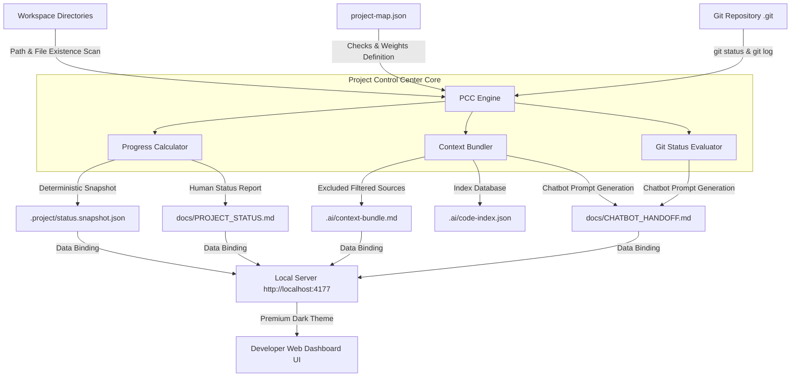

# Project Control Center Specification

`Version: 1.0.0` | `Status: Approved` | `Audience: AI Agents & Human Developers`

---

## 1. Executive Summary & Core Objectives

The **Project Control Center** is a developer-only, local-only utility dashboard designed to streamline the progress tracking and AI context management of the *Interactive Cognitive-Behavioral Profile Assessment* workspace. It serves as the primary coordination layer for "vibe coding" workflows between human developers and AI assistants (Codex/Gemini).

> [!IMPORTANT]
> **Primary Rule of Isolation**: The Project Control Center is strictly a supporting developer tool. Under no circumstances should its code base mingle with, import from, or export into the main product codebase, nor should it introduce dependencies to the production build.

```
+--------------------------------------------------------------------------+
|                       PROJECT CONTROL CENTER (PCC)                       |
|                                                                          |
|  [Scan Repo] ----> [Calculate MVP %] ----> [Generate Status Snapshot]   |
|         |                                              |                 |
|         v                                              v                 |
|  [Inspect Git]                               [AI Handoff Markdown]       |
|         |                                              |                 |
|         v                                              v                 |
|  [Local Web UI] <=============================> [Copy Prompts Portal]    |
+--------------------------------------------------------------------------+
```

### Key Questions Answered by the Dashboard
*   **What phase is the project in?** Dynamic phase categorization based on repository layout.
*   **What percentage is the MVP at?** Quantifiable progress bar calculated via deterministic rules.
*   **What has been completed & what is missing?** Structural checklist of required module layers and specs.
*   **What changed recently?** Immediate visibility into the working tree, staged items, and git commits.
*   **What should I ask Codex next?** Smart recommendations based on remaining roadmap items.
*   **What context should I copy to another chatbot?** Seamless copy-to-clipboard markdown bundles.

---

## 2. System Architecture & Flow

The following Mermaid diagram outlines how the Project Control Center reads local workspace configurations, queries Git state, computes deterministic progress, and produces dashboards or AI context handoffs:



---

## 3. UI Dashboard Layout (Visual & Design Spec)

The Project Control Center interface must feel extremely premium, responsive, and state-of-the-art. It operates with a sleek developer-oriented visual system.

### Color Palette (Harmonized Dark Theme)
*   **Background (Slate 900)**: `#0F172A` (Deep background)
*   **Card Background (Slate 800)**: `#1E293B` (Elevated blocks with glassmorphism styling)
*   **Sky Accent**: `#38BDF8` (Interactive elements, primary button states)
*   **Emerald Success**: `#10B981` (Completed tasks, clean git states)
*   **Amber Warning**: `#F59E0B` (Dirty git states, partial tasks)
*   **Rose Critical**: `#EF4444` (Missing core structures)

### UI Components & Tabs

#### Tab A: Workspace Monitor (Overview)
1.  **Global MVP Completion Gauge**: A central radial gradient progress indicator demonstrating the weighted progress computed from `project-map.json`.
2.  **Git Branch & Status Widget**:
    *   Displays current branch with a glowing terminal icon.
    *   Displays Git working tree status (Clean/Dirty).
    *   Shows last 3 commits in a condensed, clean, monospaced view.
3.  **Action Bar**:
    *   `[Refresh Scan]` with a spinning micro-animation.
    *   `[Export Hand-off]` triggering snapshot sync & markdown builds.

#### Tab B: Phase Roadmap
An elegant grid categorized into the 7 key tasks (as outlined in `docs/CODEX_TASKS.md`):
*   Each card outlines completion status, file path targets, and validation checks.
*   Clicking a card expands details to show precisely **what exists** vs. **what is missing** (e.g. missing scoring adapter or unit tests).

#### Tab C: AI Copilot Portal
A library of quick-action cards equipped with smooth hover actions and a **Copy to Clipboard** utility:
*   **Chatbot Handoff Card**: Copies a structured prompt containing the last commits, current file tree, open tasks, and next prompt.
*   **Codex Task Prompt Card**: Generates the exact context necessary to start the next incremental task block.
*   **Git Diff Code Review Card**: Bundles `git diff` with instructions for a comprehensive AI review.

---

## 4. Progress Engine & Data Schemas

Progress is strictly computed from a versioned JSON state map. The Project Control Center parses this schema to perform deterministic checks.

### Schema Spec: `tools/project-control-center/project-map.json`
```json
{
  "$schema": "http://json-schema.org/draft-07/schema#",
  "version": "1.0.0",
  "phases": [
    {
      "id": "phase-1",
      "name": "Phase 1 - Scaffold & Environment",
      "weight": 0.15,
      "checks": [
        {
          "id": "check-package-json",
          "type": "file_exists",
          "path": "package.json"
        },
        {
          "id": "check-ts-config",
          "type": "file_exists",
          "path": "tsconfig.json"
        }
      ]
    },
    {
      "id": "phase-2",
      "name": "Phase 2 - Core Layers",
      "weight": 0.25,
      "checks": [
        {
          "id": "check-orchestrator",
          "type": "file_exists",
          "path": "src/core/orchestrator/TestOrchestrator.ts"
        },
        {
          "id": "check-event-tracker",
          "type": "file_exists",
          "path": "src/core/tracking/EventTracker.ts"
        }
      ]
    }
  ]
}
```

### Dynamic Snapshot Format: `.project/status.snapshot.json`
Every repository scan automatically computes and updates this snapshot:
```json
{
  "lastUpdated": "2026-05-22T09:30:00Z",
  "gitBranch": "main",
  "gitDirty": true,
  "mvpProgressPercentage": 45.5,
  "completedChecks": ["check-package-json", "check-ts-config"],
  "pendingChecks": ["check-orchestrator", "check-event-tracker"],
  "nextRecommendedTask": {
    "taskId": "Task 2",
    "description": "Implement TestOrchestrator and core state contracts."
  }
}
```

---

## 5. Security & Isolation Guards

To preserve workspace safety, compliance, and strict code isolation, the Project Control Center operates under four security constraints:

> [!WARNING]
> **Strict Context Exclusions**: The AI Context Bundler must never export or inspect sensitive files. The following list of files and patterns must be strictly blacklisted in the scanning engine:
> *   Environment configs: `.env`, `.env.local`, `.env.*`
> *   Dependency packages: `node_modules/`, `bower_components/`
> *   Build artifacts: `dist/`, `build/`, `out/`, `.next/`
> *   Git metadata: `.git/`
> *   Binary files: `.png`, `.jpg`, `.jpeg`, `.pdf`, `.zip`, `.gz`

> [!CAUTION]
> **Code Sandbox Boundary**: The Project Control Center is entirely read-only with respect to the `src/` product folder. It must never append, edit, or delete production application code or items. Its write access is strictly limited to:
> *   `tools/project-control-center/`
> *   `docs/PROJECT_STATUS.md`
> *   `docs/CHATBOT_HANDOFF.md`
> *   `.project/`
> *   `.ai/`

---

## 6. Definition of Done (DoD) for implementation

A candidate implementation of the Project Control Center is deemed complete only when it satisfies all criteria below:

- [ ] **Deterministic Scanner**: Accurately scans file existence and calculates real progress based on `project-map.json`.
- [ ] **Git Connector**: Captures git status, branch name, and recent commit history using non-blocking child processes.
- [ ] **Local Dashboard UI**: Serves a modern local web server displaying all data using custom palettes, visual animations, and glassmorphism styling.
- [ ] **Artifact Writer**: Synchronizes dynamic markdown files (`docs/PROJECT_STATUS.md`, `docs/CHATBOT_HANDOFF.md`) on every reload.
- [ ] **Quick Copier**: Includes functional copy-to-clipboard portals for prompt templates without breaking on modern browsers.
- [ ] **Safety Compliance**: Passes build, lint, and typechecks, confirming that no secrets or binary assets are crawled.