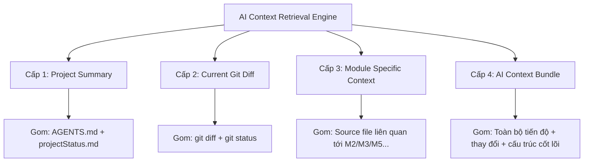

# Project Map & Progress Model

Tài liệu này giải thích mô hình ước lượng tiến độ dự án và cấu trúc vận hành của **Project Control Center** (công cụ quản lý tiến độ nội bộ).

---

## Mô hình Tiến độ (Progress Model)

Hệ thống sử dụng phương pháp kiểm tra sự tồn tại của các file/thư mục đặc trưng để tính toán tiến độ tương đối của MVP.

### Bảng Trọng số các Phase (Checklist Phases)

| Phase | Trọng số | Ý nghĩa & Mô tả | Các file/thư mục kiểm tra |
| :---: | :---: | :--- | :--- |
| **P0** | 10% | Tài liệu dự án, cấu hình Codex, Skills nền tảng | `AGENTS.md`, `docs/`, `.codex/config.toml`, `.agents/skills/...` |
| **P0.5** | 5% | Cấu trúc & Tool Project Control Center | `tools/project-control-center/`, `.project/`, `.ai/` |
| **P1** | 10% | Scaffold ứng dụng & Môi trường phát triển | `package.json`, `tsconfig.json`, `src/`, `tests/` |
| **P2** | 15% | Contracts cốt lõi & Schemas dữ liệu | `src/core/contracts/` (`assessment.ts`, `events.ts`, `scoring.ts`, `report.ts`) |
| **P3** | 15% | Event Tracker & Khôi phục trạng thái Local | `src/core/tracking/` (`EventTracker.ts`, `focusTracking.ts`, `eventValidation.ts`) |
| **P4** | 10% | Test Orchestrator & Đăng ký Module | `src/core/orchestrator/` (`TestOrchestrator.ts`, `moduleRegistry.ts`, `stateMachine.ts`) |
| **P5** | 15% | Scoring Engine & Các Adapters chấm điểm | `src/core/scoring/` (`ScoringEngine.ts`, `dataQuality.ts`, `normalization.ts`, `profileAggregator.ts`) |
| **P6** | 15% | Phát triển các Modules MVP (M2, M3, M5, M9) | `src/modules/` (`m2-inhibitory-control`, `m3-working-memory`, `m5-procedural-reasoning`, `m9-metacognition`) |
| **P7** | 10% | Báo cáo, Xuất dữ liệu, QA & Kiểm thử | `src/report/`, `src/export/`, `docs/projectStatus.md`, `docs/CHATBOT_HANDOFF.md` |

> [!NOTE]
> Tổng trọng số là **105%** bao gồm phase phụ **P0.5** (Project Control Center). Khi tính tiến độ thuần của MVP App, có thể tùy chọn loại bỏ P0.5 để quy về 100% chuẩn, hoặc tính song song cả hai chỉ số.

---

## Tại sao sử dụng File Existence Checks?

Dự án này được phát triển theo phương pháp **Vibe Coding** phối hợp giữa Lập trình viên và AI (Codex/Chatbot).
Việc kiểm tra sự tồn tại của file mang lại các lợi ích thực tế:
- **Trực quan & Đơn giản:** Người dùng dễ dàng nắm bắt những gì đã có, những gì đang thiếu.
- **Dễ dàng tự động hóa:** CLI script có thể chạy cực nhanh bằng Node.js mà không cần parsing phức tạp hay kết nối Database.
- **Tính thực tế cao:** Đảm bảo cấu trúc thư mục luôn tuân thủ nghiêm ngặt tài liệu kiến trúc ban đầu.

---

## Cấu trúc Thư mục Hệ thống Quản lý

Dưới đây là cấu trúc thư mục của dự án tập trung vào các công cụ quản lý (`tools/`) và các thư mục bổ trợ ngữ cảnh AI (`.ai/`, `.project/`):

```text
diemmanh/
├── .agents/
│   └── skills/
│       ├── assessment-architecture-guard/
│       ├── assessment-module-builder/
│       ├── scoring-adapter-builder/
│       └── project-control-center-builder/
│               └── SKILL.md                 # Định nghĩa workflow build tool
├── .ai/
│   └── README.md                            # Nơi chứa Context Bundle xuất cho AI
├── .codex/
│   └── config.toml                          # Cấu hình Codex
├── .project/
│   └── README.md                            # Nơi lưu trữ trạng thái máy đọc (snapshot)
├── docs/
│   ├── projectStatus.md                     # Tiến trình dự án (người đọc)
│   └── CHATBOT_HANDOFF.md                   # Prompt chuyển giao ngữ cảnh cho AI
└── tools/
    └── project-control-center/
        ├── AGENTS.md                        # Chỉ dẫn cục bộ cho Codex khi làm việc với tool
        ├── README.md                        # Hướng dẫn sử dụng dashboard
        ├── controlCenterSpec.md             # Đặc tả tính năng của Control Center
        ├── projectMap.md                    # Hướng dẫn này (Mô hình tiến độ)
        ├── project-map.json                 # Cấu hình checklist dạng máy đọc (JSON)
        └── CODEX_PROMPTS.md                 # Các mẫu câu lệnh tối ưu cho Codex
```

---

## Chi tiết Đặc tả các Thành phần trong Tool

Dưới đây là các tài liệu cấu hình chi tiết của từng file thành phần, giúp Codex hiểu và triển khai chính xác Project Control Center.

### 1. `project-map.json` (Cấu hình checklist máy đọc)
```json
{
  "projectName": "Interactive Cognitive-Behavioral Profile Assessment",
  "version": "0.1.0",
  "progressType": "development-checklist",
  "phases": [
    {
      "id": "P0",
      "name": "Project docs, Codex config, skills",
      "weight": 10,
      "checks": [
        "AGENTS.md",
        "docs/TDD.md",
        "docs/ThuatToan.md",
        "docs/mvpScope.md",
        "docs/ARCHITECTURE.md",
        "docs/moduleContracts.md",
        "docs/dataSchema.md",
        "docs/eventTrackingSpec.md",
        "docs/testingStrategy.md",
        "docs/itemBankGuidelines.md",
        "docs/CODEX_TASKS.md",
        ".codex/config.toml",
        ".agents/skills/assessment-architecture-guard/SKILL.md",
        ".agents/skills/assessment-module-builder/SKILL.md",
        ".agents/skills/scoring-adapter-builder/SKILL.md"
      ]
    },
    {
      "id": "P0.5",
      "name": "Project Control Center setup",
      "weight": 5,
      "checks": [
        "tools/project-control-center/AGENTS.md",
        "tools/project-control-center/README.md",
        "tools/project-control-center/controlCenterSpec.md",
        "tools/project-control-center/projectMap.md",
        "tools/project-control-center/project-map.json",
        "tools/project-control-center/CODEX_PROMPTS.md",
        ".agents/skills/project-control-center-builder/SKILL.md"
      ]
    },
    {
      "id": "P1",
      "name": "App scaffold and dev environment",
      "weight": 10,
      "checks": [
        "package.json",
        "tsconfig.json",
        "src",
        "tests"
      ]
    },
    {
      "id": "P2",
      "name": "Core contracts and data schemas",
      "weight": 15,
      "checks": [
        "src/core/contracts",
        "src/core/contracts/assessment.ts",
        "src/core/contracts/events.ts",
        "src/core/contracts/scoring.ts",
        "src/core/contracts/report.ts"
      ]
    },
    {
      "id": "P3",
      "name": "Event Tracker and local state recovery",
      "weight": 15,
      "checks": [
        "src/core/tracking",
        "src/core/tracking/EventTracker.ts",
        "src/core/tracking/focusTracking.ts",
        "src/core/tracking/eventValidation.ts"
      ]
    },
    {
      "id": "P4",
      "name": "Test Orchestrator and module registry",
      "weight": 10,
      "checks": [
        "src/core/orchestrator",
        "src/core/orchestrator/TestOrchestrator.ts",
        "src/core/orchestrator/moduleRegistry.ts",
        "src/core/orchestrator/stateMachine.ts"
      ]
    },
    {
      "id": "P5",
      "name": "Scoring Engine and scoring adapters",
      "weight": 15,
      "checks": [
        "src/core/scoring",
        "src/core/scoring/ScoringEngine.ts",
        "src/core/scoring/dataQuality.ts",
        "src/core/scoring/normalization.ts",
        "src/core/scoring/profileAggregator.ts"
      ]
    },
    {
      "id": "P6",
      "name": "MVP modules M2, M3, M5, M9",
      "weight": 15,
      "checks": [
        "src/modules/m2-inhibitory-control",
        "src/modules/m3-working-memory",
        "src/modules/m5-procedural-reasoning",
        "src/modules/m9-metacognition"
      ]
    },
    {
      "id": "P7",
      "name": "Report, export, QA, internal test",
      "weight": 10,
      "checks": [
        "src/report",
        "src/export",
        "src/report/RadarProfile.ts",
        "src/export/exportJson.ts",
        "src/export/exportCsv.ts",
        "docs/projectStatus.md",
        "docs/CHATBOT_HANDOFF.md"
      ]
    }
  ],
  "readiness": {
    "codexReadinessChecks": [
      "AGENTS.md",
      ".codex/config.toml",
      ".agents/skills",
      "docs",
      "tools/project-control-center/controlCenterSpec.md"
    ],
    "productionReadinessChecks": [
      "src/modules/m2-inhibitory-control",
      "src/modules/m3-working-memory",
      "src/modules/m5-procedural-reasoning",
      "src/modules/m9-metacognition",
      "src/core/scoring/ScoringEngine.ts",
      "src/export/exportJson.ts",
      "src/export/exportCsv.ts",
      "docs/projectStatus.md"
    ]
  }
}
```

### 2. `.agents/skills/project-control-center-builder/SKILL.md` (Workflow của Codex)
```markdown
---
name: project-control-center-builder
description: Sử dụng khi xây dựng hoặc cập nhật công cụ Project Control Center nội bộ dùng để theo dõi tiến độ repo, trạng thái Git, xuất ngữ cảnh AI và đề xuất các câu lệnh tiếp theo cho Codex.
---

## Trách nhiệm cốt lõi
- Theo dõi tiến độ MVP một cách trực quan.
- Đọc trạng thái repo từ tài liệu, Git, cấu hình JSON và kiểm tra sự tồn tại của file.
- Tạo mã ngữ cảnh AI copyable để dán vào Codex hoặc chatbot khác.
- Cập nhật tự động các file: `docs/projectStatus.md`, `docs/CHATBOT_HANDOFF.md`, `.project/status.snapshot.json`.

## Ranh giới phát triển (Hard Boundaries)
- Tuyệt đối KHÔNG cấu trúc hoặc thay đổi code của ứng dụng chính từ công cụ này.
- Không tự ý tạo thư mục `src/` cho ứng dụng chính.
- Đây là công cụ phục vụ phát triển nội bộ (Dev-only Tool), không phải là sản phẩm cuối dành cho người dùng.

## Công thức tính Tiến độ
- Sử dụng bảng cấu hình tại `tools/project-control-center/project-map.json`.
- Mỗi phase có một trọng số (`weight`) và danh sách file kiểm tra (`checks`).
- Trạng thái hoàn thành của check = file/thư mục có tồn tại trên ổ đĩa hay không.
- Tỉ lệ hoàn thành của Phase = `completed_checks / total_checks`.
- Điểm tiến độ MVP tổng thể = `Sum(phase.weight * phase.completionRatio)`.
```

### 3. `tools/project-control-center/AGENTS.md` (Chỉ dẫn cục bộ cho Codex)
```markdown
# AGENTS.md - Project Control Center

## Phạm vi hoạt động
Thư mục này chứa công cụ Project Control Center chạy ở môi trường local dành riêng cho lập trình viên.

## Luật cứng nhắc
- Không chỉnh sửa code logic của ứng dụng chính từ thư mục này.
- Không được đưa thông tin nhạy cảm (API Keys, secrets, credentials, GitHub tokens) vào gói ngữ cảnh xuất cho AI (`.ai/`).
- Tránh import các thư viện nặng không cần thiết. Ưu tiên giải pháp Node.js tối giản + TypeScript.
- Kết quả phần trăm tiến độ là thước đo công việc checklist kỹ thuật, không đại diện cho tính chính xác hay kiểm định khoa học của bài đánh giá tâm lý.
```

### 4. `tools/project-control-center/controlCenterSpec.md` (Đặc tả tính năng công cụ)
```markdown
# Project Control Center Spec

## Mục tiêu
Tạo một Dashboard giao diện web chạy ở local giúp lập trình viên quản lý toàn bộ quá trình Vibe Coding một cách trực quan và đồng bộ.

## Giao diện Dashboard (Web UI local)
Chạy tại địa chỉ mặc định `http://localhost:4177` với các cấu phần:
1. **Tổng quan (Overview):** Tên dự án, Git branch hiện tại, trạng thái working tree (clean/dirty), tiến độ MVP %, tiến độ sẵn sàng của Codex %, tiến độ sản xuất %.
2. **Chi tiết các Phase (Phase Checklist):** Bảng hiển thị danh sách các phase, trọng số, tỉ lệ hoàn thành, danh sách các file đã có (màu xanh) và các file còn thiếu (màu đỏ).
3. **Tóm tắt Git (Git Summary):** Danh sách các file mới thay đổi, file đã staged, và 5 commit gần nhất.
4. **Trình xuất Ngữ cảnh AI (AI Context Export):** Hệ thống các nút bấm tiện ích để sao chép nhanh Prompt/Ngữ cảnh gửi cho AI.

## Các Nút Sao chép Tiện ích (AI Export Panel)
- **Copy Chatbot Handoff:** Prompt đầy đủ kèm trạng thái hiện tại để chuyển đổi sang Chatbot khác.
- **Copy Git Diff Review:** Chạy lệnh `git diff` để copy thay đổi mới nhất giúp AI review chất lượng code.
- **Copy Next Codex Prompt:** Đề xuất câu lệnh tiếp theo dựa trên phase hiện tại và checklist các file còn thiếu.
- **Copy Architecture Context:** Sao chép các tài liệu thiết kế hệ thống chính trong thư mục `docs/`.
```

---

## Hệ thống Xuất ngữ cảnh AI (4 Cấp độ Context)

Để tối ưu hóa dung lượng token khi trao đổi với AI, Control Center hỗ trợ xuất ngữ cảnh theo 4 cấp độ riêng biệt:



### Quy tắc lọc File (Filtering & Safety Rules)
- **Allowlist (Chỉ lấy các file quan trọng):** `AGENTS.md`, `docs/**/*.md`, `package.json`, `src/core/**/*.ts`, `src/modules/**/*.{ts,tsx}`, `tests/**/*.ts`.
- **Excludelist (Bỏ qua hoàn toàn):** `node_modules/`, `dist/`, `build/`, `.git/`, các file đa phương tiện (`.png`, `.jpg`, `.pdf`), file nén (`.zip`), file thực thi (`.exe`, `.dll`) và đặc biệt là các file bảo mật như `.env`, `.env.*`.

---

## Hướng dẫn Vận hành & Phát triển

### 1. Khởi tạo Thư mục bằng PowerShell
```powershell
# Chạy tại thư mục gốc của repo
mkdir tools -ErrorAction SilentlyContinue
mkdir tools\project-control-center -ErrorAction SilentlyContinue
mkdir .ai -ErrorAction SilentlyContinue
mkdir .project -ErrorAction SilentlyContinue
mkdir .agents\skills\project-control-center-builder -ErrorAction SilentlyContinue
```

### 2. Các lệnh NPM dự kiến
```bash
# Di chuyển tới thư mục tool
cd tools/project-control-center

# Cài đặt thư viện phụ thuộc
npm install

# Quét repo và cập nhật snapshot/tài liệu tiến độ
npm run scan

# Khởi chạy Dashboard Web local (http://localhost:4177)
npm run dev
```

### 3. Quy trình Commit sau mỗi lượt Code thành công
Mỗi khi AI hoàn thành một tính năng hoặc thay đổi cấu trúc repo:
1. Chạy lệnh cập nhật tiến độ: `npm run scan` hoặc `npm run project:status`.
2. Commit toàn bộ thay đổi công cụ và tài liệu tiến độ mới:
   ```bash
   git add tools/project-control-center docs/projectStatus.md docs/CHATBOT_HANDOFF.md .project/status.snapshot.json
   git commit -m "chore(tools): update project control center and progress status"
   ```